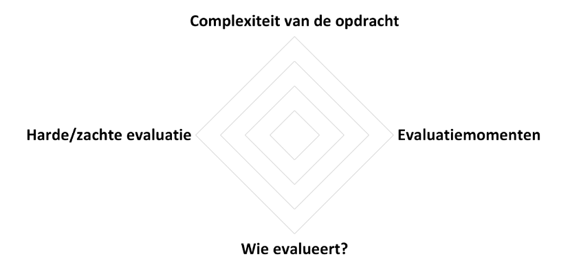

# Basisconcepten evalueren

Computationeel denken kan in alle reguliere lessen aan bod komen. Telkens de leerlingen met een probleem geconfronteerd worden, kan computationeel denken een houvast bieden bij het zoeken naar een oplossing. Afhankelijk van de aard van het probleem zullen bepaalde concepten en handelingen van computationeel denken al dan niet aan bod komen.  
Afhankelijk van de duur en het belang van een opdracht kunnen er bv. meer of minder evaluatiemomenten zijn, en kan er een voorkeur zijn voor bepaalde evaluatievormen.  

## Computationeel denken bij de aanpak van een probleem

<strong><h5>Een definitie van computationeel denken</h5></strong> 
    
_Computationeel denken is een methodologie om een complex probleem aan te pakken, op een manier dat een computer zou kunnen ingezet worden om het op te lossen._    

Computationeel denken steunt op vier **basisconcepten**: decompositie, patroonherkenning, abstractie en algoritmisch denken.  
Meer uitleg over de ze concepten kreeg je [hier](https://www.dwengo.org/backend/api/learningObject/getWrapped?hruid=ct_voorbeelden1&version=3&language=nl).

Ons [schema met de vier basisconcepten](https://www.dwengo.org/backend/api/learningObject/getWrapped?hruid=ct_voorbeelden8&version=3&language=nl) biedt een houvast bij het aanpakken van een probleem. 

## Mogelijke leerdoelen van computationeel denken

Als leerkracht zal je nadenken over welke kennis, vaardigheden en attitudes van computationeel denken er aan bod komen in een bepaalde lessenreeks, waarop je zal kiezen welke je zal evalueren en hoe.  
**Bij het oplossen van een probleem zal een basisconcept niet geïsoleerd voorkomen.** Dus meerdere doelen die met meerdere basisconcepten overeenkomen kunnen geëvalueerd worden. 

### Mogelijke leerdoelen betreffende decompositie 

|Decompositie|
|--------------|
|De leerlingen identificeren een complex probleem als een probleem dat kan worden opgesplitst in deelproblemen.|
|De leerlingen splitsten een complex probleem op in goedgekozen deelproblemen.|
|De leerlingen controleren of elk deelprobleem afzonderlijk kan worden opgelost.|
|De leerlingen beslissen welke deelproblemen het belangrijkst zijn om eerst op te lossen en bepalen zo de juiste volgorde om het probleem op te lossen.|
|De leerlingen integreren de deeloplossingen tot een coherent geheel en lossen hiermee het probleem op.1| 
|De leerlingen structureren data in tabellen om het meer bruikbaar te maken.1|
|De leerlingen bewaren bestanden, daarbij gebruikmakend van geschikte namen voor bestanden en mappen.1| 

### Mogelijke leerdoelen betreffende patroonherkenning

|Patroonherkenning|
|--------------|
|De leerlingen achterhalen of een (deel)probleem gelijkenis vertoont met een eerder opgelost probleem in functie van hergebruik van de oplossing.|
|De leerlingen achterhalen of de oplossing van een eerder opgelost probleem zo kan worden aangepast dat het een nieuw probleem oplost.|
|De leerlingen visualiseren data om te achterhalen of er patronen in de data kunnen worden waargenomen in functie van trends of voorspellingen.|
|De leerlingen achterhalen het verband tussen patroonherkenning en het identificeren van 'objecten' zoals voertuigen op de weg, gezichtsherkenning, gelaatsuitdrukking, handschriftherkenning, sentimentanalyse in taal ...|
|De leerlingen achterhalen het verband tussen patroonherkenning en een beslissingsboom. Het gaat hierbij om het detecteren van patronen in gegevens, waarmee een systeem kan 'leren' of 'besluiten' hoe te reageren via een beslissingsboom.| 
|De leerlingen zien in dat alle software uitgevoerd door een digitaal toestel geprogrammeerd is.1|
|De leerlingen zien in dat heel wat digitale toestellen aangestuurd worden door een computer.1| 
|De leerlingen kennen toepassingen van digitale systemen uit de wereld buiten het klaslokaal.1|
|De leerlingen passen verschillende datatypes correct toe, zoals text, getal, lijst.1|
|De leerlingen delen een invoer- of uitvoertoestel in bij de juiste categorie, zij het een invoer- of uitvoertoestel.1|
|De leerlingen weten dat ze met een functie details van een deeloplossing kunnen verbergen.1|
|De leerlingen zien in dat sommige problemen niet met de computer kunnen worden opgelost.1|
|De leerlingen zien in dat een digitale voorstelling meerdere vormen kan aannemen.1|
|De leerlingen bieden data aan de computer aan in de juiste digitale voorstelling.1|

### Mogelijke leerdoelen betreffende abstractie

|Abstractie|
|--------------|
|De leerlingen passen abstractie toe door de essentiële stappen voor het oplossen van een probleem te bepalen.|
|De leerlingen passen abstractie toe door een model, simulatie of representatie te maken.|
|De leerlingen passen abstractie toe door gegevens logisch te ordenen.|
|De leerlingen passen abstractie in een programmeeropdracht toe door gebruik te maken van functies en procedures.|
|De leerlingen passen abstractie in een programmeeropdracht toe door gebruik te maken van objecten en klassen.| 
|De leerlingen passen abstractie toe door gebruik te maken van datastructuren, die helpen om gegevens te organiseren op een gestructureerde manier (zoals arrays, lijsten, stapels, bomen en grafen).|
|De leerlingen leggen uit dat bij de overgang van analoog naar digitaal er informatie verloren gaat.|
|De leerlingen kennen het verschil tussen data en informatie.1|
|De leerlingen weten digitale voorstellingen gebeuren a.d.h.v. binaire getallen.1|
|De leerlingen bergijpen hoe een bit-patroon een getal of afbeelding voorstelt.1|
|De leerlingen leggen uit wat het verschil is tussen het internet en het world wide web.1|
|De leerlingen gebruiken een functie om de details van een deeloplossing te verbergen.1|
|De leerlingen definiëren een functie om de details van een deeloplossing te verbergen.1|
|De leerlingen kiezen het juiste datatype voor een representatie.1|

### Mogelijke leerdoelen betreffende algoritmisch denken 

|Algoritmisch denken|
|--------------|
|De leerlingen formuleren een oplossing op een manier dat een computer het kan oplossen.|
|De leerlingen analyseren mogelijke oplossingen en kiezen de beste oplossingsstrategie.|
|De leerlingen expliciteren een reeks van geordende instructies om het probleem op te lossen.|
|De leerlingen optimaliseren de oplossingsstrategie door het probleem in zo weinig mogelijk stappen op te lossen.|
|De leerlingen voeren de oplossingsstrategie uit en sturen indien nodig de oplossingsstrategie bij.| 
|De leerlingen begrijpen dat computers preciese instructies nodig hebben.1|
|De leerlingen begrijpen dat heel wat digitale toestellen werken op basis van een algoritme.1| 
|De leerlingen analyseren en evalueren data en informatie, en leggen uit dat data van slechte kwaliteit leidt tot onbetrouwbare resultaten en onnauwkeurige conclusies.1| 
|De leerlingen redeneren logisch om de uitvoer van een algoritme / programma te voorspellen.1|
|De leerlingen kunnen semantische fouten in een programma opsporen en verhelpen.1|
|De leerlingen stellen data voor in een digitale vorm.1||

----------------
1 Bron: https://teachinglondoncomputing.files.wordpress.com/2014/07/computing_progression_pathways_with_computational_thinking_v2-3.pdf 

-----------------

## Sjabloon

We stellen een sjabloon voor dat kan gebruikt worden als 'evaluatievoorbereiding'.
Ja kan als leerkracht dit sjabloon gebruiken om over de evaluatie bij een bepaalde opdracht of een bepaald project na te denken.

Het sjabloon omvat vier elementen: 
- de complexiteit van de opdracht;
- evaluatiemomenten;
- harde en/of zachte evaluatie;
- wie er evalueert.
  
Bij deze elementen zijn er telkens vier mogelijkheden, genummerd van 1 t.e.m. 4 (dit houdt geen gradatie in).

||Complexiteit|Evaluatiemomenten|Harde/zachte evaluatie|wie evalueert?|
|--|------------|-----------------|----------------------|--------------|
|1|Eenvoudig|Eenmalige formatieve evaluatie|Product (harde evaluatie)|Leraar|
|2|Gemiddeld|Eenmalige summatieve evaluatie|Proces (zachte evaluatie)|Leraar en leerling|
|3|Complex|Meerdere formatieve evaluaties|Product & proces (zachte evaluatie) |Leraar, leerling en medeleerlingen|
|4|Uitdagend|Meerdere formatieve en summatieve evaluaties|Product & proces (combi harde en zachte evaluatie)|Leraar, leerlingen, medeleerlingen en anderen (ouders, externe jury ...).|

#### Complexiteit

De complexiteit van een opdracht hangt af van meerdere factoren, zoals: 
- de hoeveelheid kennis er vereist is,
- hoe vaardig men ergens moet in zijn en of er een nieuwe vaardigheid moet verworven worden,
- hoe creatief men moet zijn,
- de mate van zelfstandigheid dat er gevraagd wordt,
- hoe open of dubbelzinnig de opdracht is,
- hoeveel deelproblemen er moeten geïdentificeerd worden,
- ...

  
#### Evaluatiemomenten

Bij het vastleggen van het aantal evauatiemomenten leg je ook vast wanneer je formatief of summatief wilt evalueren.

- Een *formatief* evaluatiemoment houdt in dat er een opdracht wordt ingezet als een middel om feedback te bieden op het leerproces, voordat een definitieve beoordeling plaatsvindt. Zo'n evaluatiemoment ondersteunt in het bereiken van de leerdoelen: het focust op het identificeren van sterke en zwakke punten, waarop de leerling, indien nodig, het leerproces kan bijsturen, al dan niet samen met de leerkracht. Het betreft dus een *tussentijdse beoordeling* van de te evalueren leerdoelen in de vorm van een cijfer of tekstbeoordeling. Een formatief evaluatiemoment  kan zowel hard of zacht zijn. 
- Een *summatief* evaluatiemoment houdt in dat een opdracht wordt ingezet om een leerprestatie te beoordelen bij het aflsuiten van een leerperiode. Het betreft een *definitieve beoordeling* in de vorm van een cijfer of tekstbeoordeling. Een summatief evaluatiemoment kan zowel hard of zacht zijn.  
- *Feedback* kan evenwel niet alleen na het uitvoeren van een opdracht worden gegeven; een vorm van 'feedback' kan ook aan het begin en gedurende het uitvoeren van een opdracht. Je spreekt dan respectievelijk van *feed-up* en *feed-forward*. Dit bevordert de gerichtheid op leerdoelen. 
- In vergelijking met eenmalige evaluaties bieden meerdere evaluaties een meer betrouwbaar en consistent beeld van de prestaties van de leerling. Formatieve evaluaties stellen leerlingen in staat om hun prestaties te verbeteren door feedback en bijsturing van hun leerproces. Via meerdere evaluaties kunnen verschillende aspecten van een leerdoel, waaronder de diepgang, belicht worden.

#### Wie evalueert?

Bij een evaluatiemoment kan jij als leerkracht evalueren, maar de leerlingen kunnen ook elkaar evalueren of zichzelf. Ook de ouders of een externe jury kunnen betrokken worden. 

De keuze voor wie evalueert hangt af van:
- de te evalueren leerdoelen,
- hoe formeel de beoordeling is en hoe zwaar die doorweegt,
- het eigenaarschap van de leerlingen,
-  ...

#### Harde en zachte evaluatie

Bij dit element denk je na over harde en zachte evaluatie, en over proces- en productevaluatie. 
- Procesevaluatie en productevaluatie zijn twee verschillende soorten evaluatie om verschillende aspecten van het leerproces te beoordelen. In essentie beoordeelt procesevaluatie het leerproces zelf, terwijl productevaluatie het resultaat van dat leerproces beoordeelt.
- Harde evaluatie is kwantitatief en meetbaar, terwijl zachte evaluatie kwalitatief is en de subjectieve aspecten van leren belicht. 

#### De evaluatievormen

Je zal ook moeten nadenken over welke evaluatievormen je wil hanteren, zoals een individuele toets, een mondelinge opdracht, een werkstuk, een portfolio, zelfevaluatie, observatie, een exit ticket ... 

-----------------------

#### Bronnen en inspiratie #### 

- Bredere evaluatie: schuiven op vier assen, Katrien Bultynck, 2004.
- Toolkit breed evalueren. Harde of zachte evaluatie, Saveyn, J., 2007. https://data-onderwijs.vlaanderen.be/documenten/bestand.ashx?id=12568
- https://formatiefevalueren.kdg.be/ 
