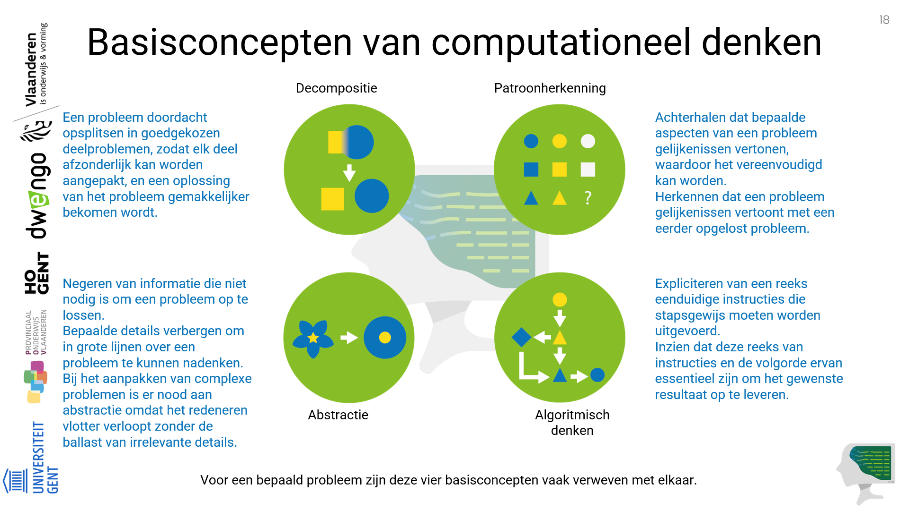

# Herhaling van de definities

In het leerpad ['Definitie en aandachtspunten'](https://www.dwengo.org/learning-path.html?hruid=ct2_concreet&language=nl&te=true&source_page=%2Fcomputational_thinking%2F&source_title=%20Computationeel%20Denken#ct_inleiding1;nl;3) maakte je kennis met een werkbare definitie van computationeel denken en met de basisconcepten ervan. 

Meer uitleg over de definitie en de basisconcepten van computationeel denken vind je in de leerpaden
['Voorbeelden'](https://www.dwengo.org/learning-path.html?hruid=ct3_voorbeelden&language=nl&te=true&source_page=%2Fcomputational_thinking%2F&source_title=%20Computationeel%20Denken#ct_inleiding_voorbeelden;nl;3) en ['Historiek'](https://www.dwengo.org/learning-path.html?hruid=ct7_historiek&language=nl&te=true&source_page=%2Fcomputational_thinking%2F&source_title=%20Computationeel%20Denken#ct_historiek1;nl;3). 

Een herhaling:

## Definitie van computationeel denken

<strong><h5>Een definitie van computationeel denken</h5></strong> 
    
_Computationeel denken is een methodologie om een complex probleem aan te pakken, op een manier dat een computer zou kunnen worden ingezet om het op te lossen._    

Computationeel denken steunt op <strong>vier basisconcepten: decompositie, abstractie, patroonherkenning en algoritmisch denken</strong>.
    
Voor een bepaald probleem zijn deze basisconcepten vaak verweven met elkaar. Computationeel denken houdt in dat het op te lossen probleem goed begrepen en geformuleerd wordt, er een oplossing bedacht wordt, er een algoritme opgesteld en (indien gewenst) geïmplementeerd wordt in de computer.

Een belangrijk aspect is het herkennen van problemen waarbij de computer inderdaad als hulpmiddel kan worden ingezet.

Voor sommige problemen is dit een efficiënte methodologie om tot een oplossing te komen, of leidt deze methodologie ertoe dat je gemakkelijker de computer kan inzetten om het probleem op te lossen. 
    
Het begrip 'computer' wordt gebruikt in de ruime zin van het woord: het geheel van hardware en software van computers, smartphones, tablets en andere informatieverwerkende systemen.     

## Basisconcepten van computationeel denken

