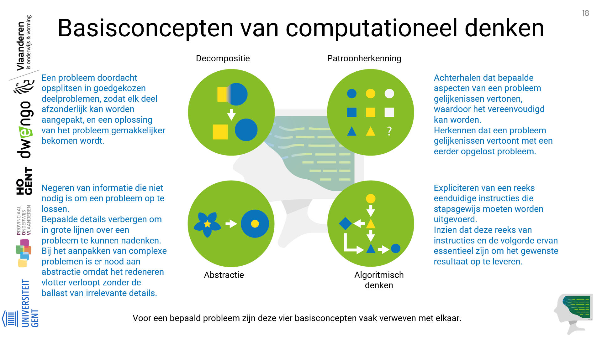

# Herhaling definitie en basisconcepten

    <strong><h5>Een definitie van computationeel denken</h5></strong> 
    <em>Computationeel denken is een methodologie om een complex probleem aan te pakken, op een manier dat een computer zou kunnen worden ingezet om het op te lossen.</em> 
     
    <strong><h5>Vier basisconcepten</h5></strong>
    Computationeel denken steunt op <strong>vier basisconcepten</strong>: 
     
    <strong>Decompositie</strong> 
    Een probleem doordacht opsplitsen in goedgekozen deelproblemen, zodat elk deel afzonderlijk kan worden aangepakt, en een oplossing van het probleem gemakkelijker bekomen wordt. 
     
    <strong>Abstractie</strong> 
    Negeren van informatie die niet nodig is om een probleem op te lossen. Bepaalde details verbergen om in grote lijnen over een probleem te kunnen nadenken.  
    Bij het aanpakken van complexe problemen is er nood aan abstractie omdat het redeneren vlotter verloopt zonder de ballast van irrelevante details.  
     
    <strong>Patroonherkenning</strong>  
    Achterhalen dat bepaalde aspecten van een probleem gelijkenissen vertonen, waardoor het vereenvoudigd kan worden.  
    Herkennen dat een probleem gelijkenissen vertoont met een eerder opgelost probleem.  
     
    <strong>Algoritmisch denken</strong>  
    Expliciteren van een reeks eenduidige instructies die stapsgewijs moeten worden uitgevoerd.  
    Inzien dat deze reeks van instructies en de volgorde ervan essentieel zijn om het gewenste resultaat op te leveren.

 

