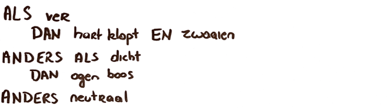

<context>
Pas het ontwerp van de sociale robot aan, rekening houdend met criteria.
</context>
<decomposition>
Leerlingen splitsen de opdracht op in de verschillende fasen/stappen die ze moeten doorlopen in het creëer-realiseer-evalueer proces (**decompositie**):
<ul>
    <li>Aftoetsen van het ontwerp aan de criteria</li>
    <li>‘Lichaam en acties robot’ aanpassen aan de criteria en beperkingen (bv. aanwezige hardware)</li>
    <li>Nodige actuatoren en sensoren aanpassen</li>
    <li>Tekening aanpassen</li>
    <li>Algoritme aanpassen</li>
</ul>
    

</decomposition>
<patternRecognition>

</patternRecognition>
<abstraction>

</abstraction>
<algorithms>
Actie(s) van de robot weergeven in een **algoritme** (Dit mag neergeschreven worden in pseudocode, omschreven worden in een zin ...) 

</algorithms>
<implementation>

</implementation>
