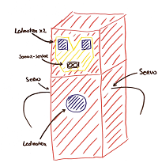

<context>
Realiseer een sociale robot gebaseerd op je eigen ontwerp.
</context>
<decomposition>
Leerlingen splitsen de opdracht op in de verschillende fasen/stappen die ze moeten doorlopen in het creëer-realiseer-evalueer proces (**decompositie**):
<ul>
    <li>(Planning opmaken)</li>
    <li>Schets van het ontwerp ‘Lichaam en acties robot’ die beantwoordt aan de criteria en gewenste acties</li>
    <li>Technische informatie: sensoren en actuatoren</li>
    <li>Tekening overbrengen op de gekozen drager</li>
    <li>Actie(s) programmeren in de simulator a.d.h.v. het neergeschreven algoritme</li>
    <li>Programma testen in de simulator, evalueren en bijsturen</li>
    <li>Acties testen a.d.h.v. de hardware </li>
    <li>Onderdelen monteren op robotlichaam</li>
    <li>Geheel testen en evalueren</li>
    <li>(Optimaliseren)</li>
</ul>
    

</decomposition>
<patternRecognition>

</patternRecognition>
<abstraction>
Hoek of snelheid van een servomotor worden **geabstraheerd** naar een geheel getal van -255 tot 255.
</abstraction>
<algorithms>
Actie(s) van de robot weergeven in een **algoritme** (Dit mag neergeschreven worden in pseudocode, omschreven worden in een zin ...) 
 
Uit de decompositie volgt het stappenplan dat meegeeft hoe te werk te gaan. (**algoritme**)
</algorithms>
<implementation>
Plaats hier een screenshot van de Blockly-code.

tekst

</implementation>
