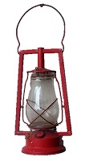

<context>
 Ontwerp en realiseer een gesloten stormlantaarn. Je moet daarbij hout en plexiglas gebruiken.   
Gnangarra. <em>Tranby House kerosene lamp</em> [Afbeelding]. CC BY 2.5 AU, via Wikimedia Commons.

</context>
<decomposition>
Verkennen van het probleem. Wat heb je nodig?   Subtaken (**decompositie**): 
<ol>
    <li>Welke houtsoort is er geschikt?</li>
    <li>Welke afmetingen zal de lantaarn hebben?</li>
    <li>Hoe zorg ik ervoor dat ik er een kaars kan in plaatsen? (deur, scharnieren)   </li>
    <li>Hoe versier ik het glas?</li>
    <li>Welke randprofilering gebruik ik?</li>
    <li>Waarmee zal ik afwerken? (verf? vernis? ...) </li>
    <li>Hoe zorg ik ervoor dat ik de lantaarn kan ophangen? Welk materiaal is daarvoor nodig? Hoe zal ik het bevestigen? </li>
</ol>
</decomposition>
<patternRecognition>
De vorm van de lantaarn is onafhankelijk van de maat. Door in het CAD-programma een van de afmetingen aan te passen worden automatisch de andere afmetingen evenredig aangepast. (**patroonherkenning**)
</patternRecognition>
<abstraction>
De geparametriseerde CAD-tekening is een **abstractie** van de werkelijke lantaarn. De lantaarn wordt herleid tot zijn afmetingen. 
</abstraction>
<algorithms>
De decompositie, m.a.w. de keuzes die de leerlingen maken, leidt tot een stappenplan die de leerlingen moeten volgen om de lantaarn te realiseren. Bij elke stap horen keuzes van materialen, gereedschap en technieken. (**algoritme**) 
</algorithms>
<implementation>
Deze activiteit gebeurt met de computer. Er wordt gebruikgemaakt van CAD-software.
</implementation>

