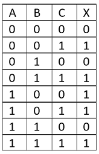
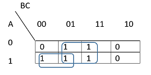
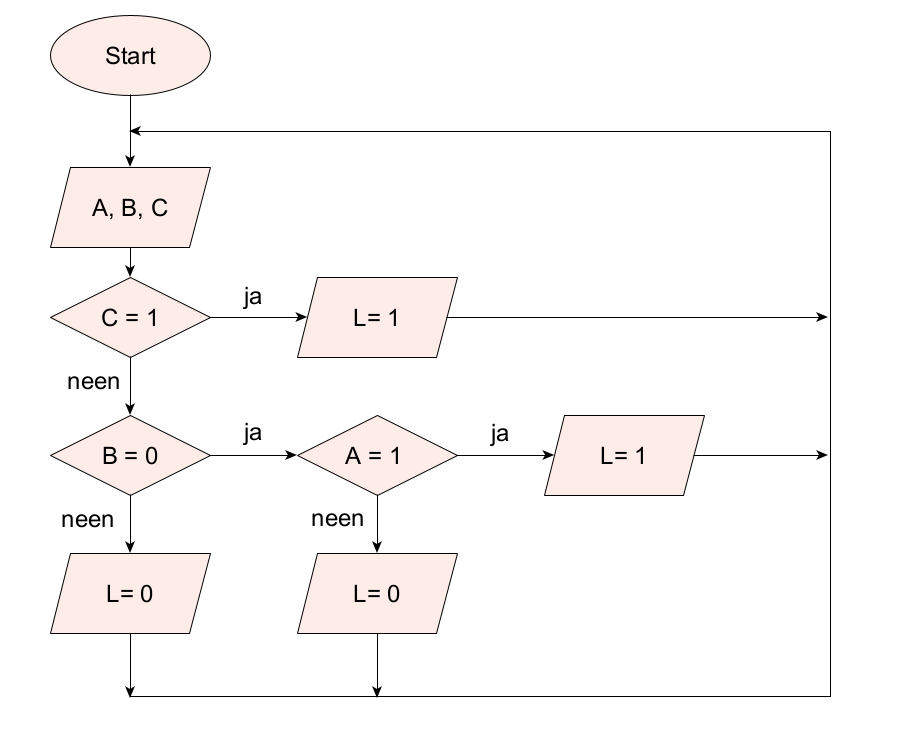
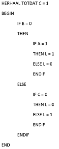

<context>
Zorg ervoor dat de buitenverlichting aan een villa in- en uitgeschakeld kan worden via een schakelaar binnen in de keuken. Deze buitenverlichting moet ook geactiveerd worden bij beweging, als het buiten donker is.   

</context>
<decomposition>
Verkennen van het probleem. Wat heb je nodig?   
Subtaken (**decompositie**): 
<ol>
    <li>Welke invoerelementen?</li>
    <li>Welke uitvoerelementen?</li>
    <li>Het gevraagde weergeven d.m.v. een waarheidstabel en Karnaugh-diagram. </li>
</ol>
</decomposition>
<patternRecognition>
Soortgelijke problemen kennen een vaste manier van aanpak: het opstellen van een waarheidstabel en het Karnaugh-diagram. (**patroonherkenning**)
</patternRecognition>
<abstraction>
Het gevraagde wordt **abstract** weergegeven d.m.v. een waarheidstabel en een Karnaugh-diagram. 
   

</abstraction>
<algorithms>
De oplossing van het probleem houdt de sturing van de verlichtingsinstallatie in a.d.h.v. een algoritme (hier in een flowchart en in pseudocode). 
 

</algorithms>
<implementation>
Deze activiteit kan zonder computer gebeuren.
</implementation>

