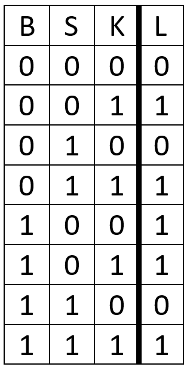
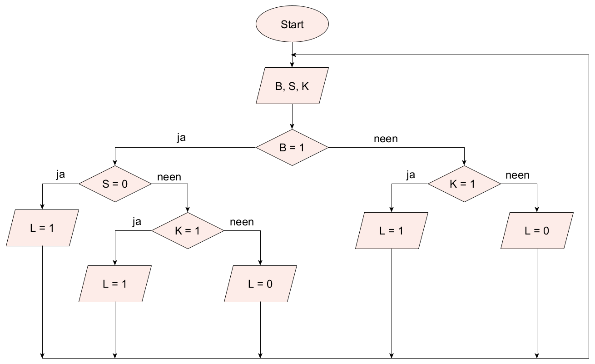

<context>
**Probleemstelling** 
Zorg ervoor dat de terrasverlichting aan een villa, als het buiten donker is, automatisch wordt geactiveerd bij beweging, en dat je deze buitenverlichting ook kan inschakelen via een schakelaar in de keuken.  
</context>
<decomposition>
**Decompositie** 
<ul>
    <li>Verkennen van het probleem. Wat heb je nodig?
    <li>Subtaken:
        <ul>
            <li>Welke invoerelementen?</li>
                <ul> <li>Bewegingsdetector B (beweging: B  = 1)</li>
                    <li>Lichtsensor S (donker: S = 0)</li>
                    <li>Schakelaar K (ingedrukt: K = 1)</li>
                </ul>
            <li>Welke uitvoerelementen?</li>
                <ul>
                    <li>Lamp L (brandt: L = 1)</li>
                </ul>
        </ul>
    </li>
    <li>Het gevraagde weergeven via een waarheidstabel. </li>
    <li>Een algoritme opstellen dat de verlichting aanstuurt.</li>
</ul>
</decomposition>
<patternRecognition>
**Patroonherkenning** 
<ul>
    <li>Soortgelijke problemen kennen een vaste manier van aanpak: het opstellen van een waarheidstabel en een algoritme. 
    <li>Op zoek gaan naar patronen in de waarheidstabel, bv. 
</ul>

   
Bekijk in welke gevallen de lamp brandt (dat is aangegeven in het lichtgroen). 
Als K = 1 (donkergroen) dan zal de lamp branden (L = 1), ongeacht de waarden van B en S. 
Voor K = 0 is er nog maar één geval waarbij de lamp ook brandt, nl. als S = 0 én B = 1 (oranje)</li>

</patternRecognition>
<abstraction>
**Abstractie** 
<ul>
    <li>De probleemstelling wordt abstract weergegeven via een waarheidstabel. De inputs staan in de eerste drie kolommen, de output in de laatste kolom.</li>
</ul>

 
</abstraction>
<algorithms>
**Algoritmisch denken** 
<ul>
    <li>De oplossing van het probleem houdt de sturing van de verlichtingsinstallatie in via een algoritme (hier verschillende oplossingen in de vorm van pseudocode of een flowchart). 
</ul>

 
  
 

</algorithms>
<implementation>
**Programma** 
Bij deze activiteit moet niet worden geprogrammeerd.
</implementation>

