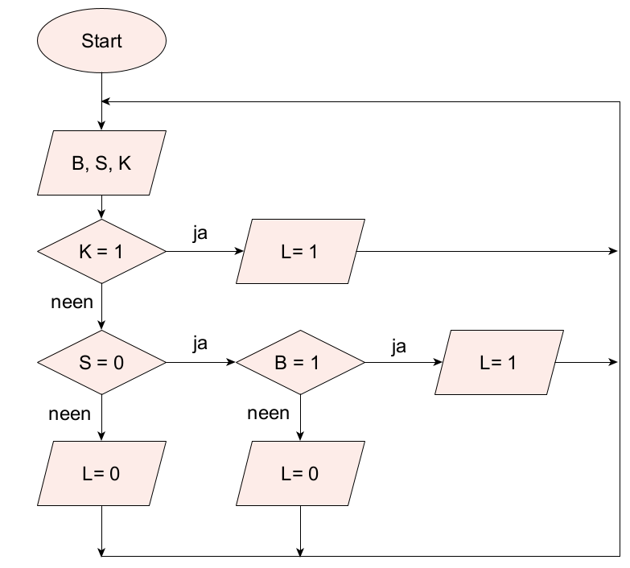
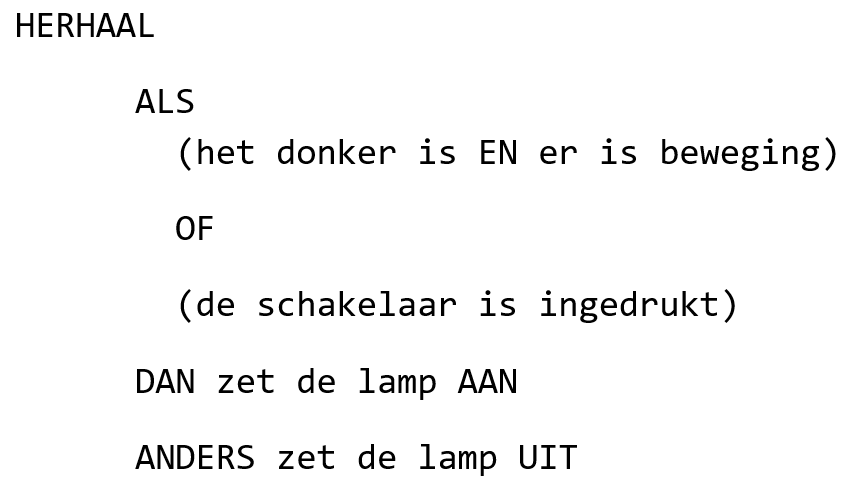
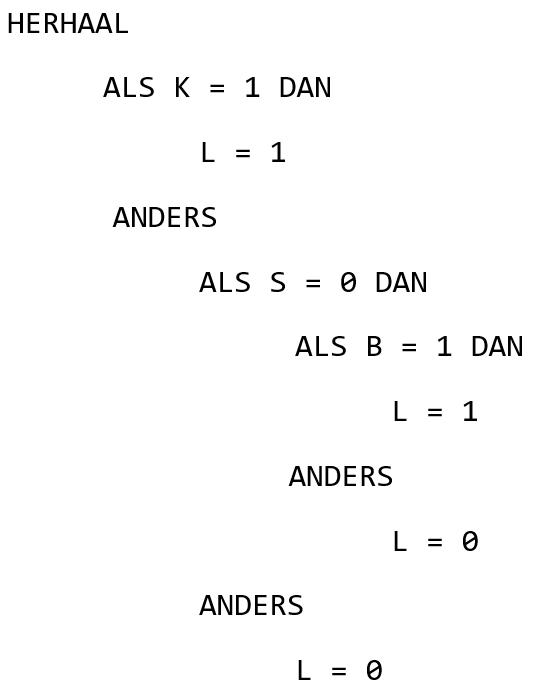

<context>
Zorg ervoor dat de terrasverlichting aan een villa, als het buiten donker is, automatisch geactiveerd wordt bij beweging, en dat je deze buitenverlichting ook kan inschakelen via een schakelaar in de keuken. 

</context>
<decomposition>
Verkennen van het probleem. Wat heb je nodig?   
Subtaken (**decompositie**): 
<ol>
    <li>Welke invoerelementen?</li>
        <ol> <li>Bewegingsdetector A (bij beweging is A  = 1)</li>
             <li>Lichtsensor B (donker: B = 0)</li>
             <li>Schakelaar C (ingedrukt: C = 1)</li>
        </ol>
    <li>Welke uitvoerelementen?</li>
        <ol>
            <li>Lamp L (brandt: L = 1)</li>
        </ol>
    <li>Het gevraagde weergeven d.m.v. een waarheidstabel. </li>
    <li>Een algoritme opstellen dat de verlichting aanstuurt.</li>
</ol>
</decomposition>
<patternRecognition>
    - Soortgelijke problemen kennen een vaste manier van aanpak: het opstellen van een waarheidstabel en een algoritme. (**patroonherkenning**) 
    - Opzoek gaan naar patronen in de waarheidstabe, bv. 
       
</patternRecognition>
<abstraction>
Het gevraagde wordt **abstract** weergegeven d.m.v. een waarheidstabel. 
   
</abstraction>
<algorithms>
De oplossing van het probleem houdt de sturing van de verlichtingsinstallatie in a.d.h.v. een **algoritme** (hier verschillende oplossingen in de vorm van pseudocode of een flowchart). 
 
 
 

</algorithms>
<implementation>
Deze activiteit kan zonder computer gebeuren.
</implementation>

