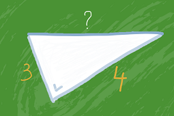

<context>
 Automatiseer het berekenen van de schuine zijde van een rechthoekige driehoek als de rechthoekszijden gekend zijn. Vraag de nodige input aan de gebruiker.
</context>
<decomposition>
Subtaken (**decompositie**): 
<ol>
    <li>Inzetten van de computer om de schuine zijde te berekenen. </li>
    <li>Formule? Gekend uit de stelling van Pythagoras.</li>
    <li>Gebruiker moet in staat zijn om de lengte van de  gegeven rechthoekszijden in te geven.</li>
    <li>Welk datatype is het meest geschikt voor die zijden? Int of float?</li>
    <li>Na de verwerking van de gegevens via de formule, is er een output. Hoe laat je de output proper verschijnen?</li>
</ol>
</decomposition>
<patternRecognition>

</patternRecognition>
<abstraction>

</abstraction>
<algorithms>
Het algoritme bevat (in deze volgorde) instructies om:
<ol>
    <li>de gegevens op te vragen aan de gebruiker;</li>
    <li>die gegevens te verwerken met als doel het bekomen van de lengte van de schuine zijde;</li>
    <li>de lengte van de schuine zijde te laten zien op het scherm. </li>
</ol>
</algorithms>
<implementation>
**Programma in Python**

# invoer 
rhz1 = float(input("Lengte van de eerste rechthoekszijde: ")) 
rhz2 = float(input(“Geef de lengte van de tweede rechthoekszijde: "))  
# verwerking 
schz = math.sqrt(rhz1**2 + rhz2**2)  
# uitvoer 
print("De lengte van de schuine zijde is: ", schz)

</implementation>
