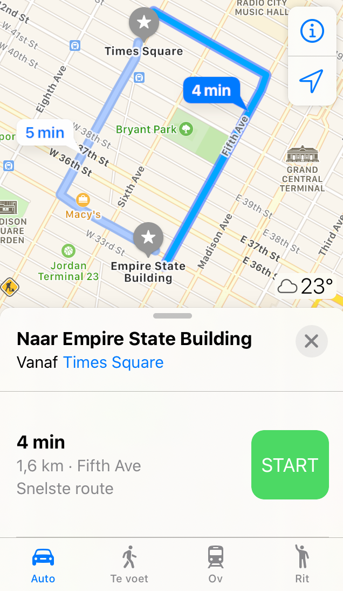
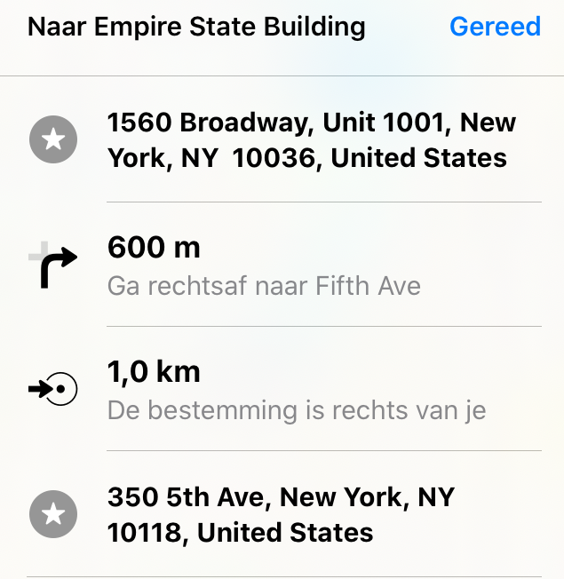

<context>
**Probleemstelling**
New York. Wat is de afstand in vogelvlucht van Times Square naar het Empire State Building, uitgedrukt in kilometer? 

</context>
<decomposition>
**Decompositie** 
<ul>
    <li>Vat het probleem samen in een figuur.</li>
    <li>Wat is gegeven? Haal wat relevant is uit de tekst en duid deze gegevens aan op de figuur (de lengtes van de twee rechthoekszijden in de gegeven route).</li>
    <li>Door patroonherkenning weet je dat dit een toepassing is van de stelling van Pythagoras. Welke formule zal je moeten gebruiken?</li>
</ul>

<!--  -->
    
<!--  -->
</decomposition>
<patternRecognition>
**Patroonherkenning** 
<ul>
    <li>Het stratenplan vertoont een patroon: de straten vormen een rechthoekig rooster.</li>
    <li>In de getekende figuur herken je een rechthoekige driehoek. De afstand in vogelvlucht komt overeen met de lengte van de schuine zijde van een rechthoekige driehoek.</li>
    <li>Je herkent dat het probleem verwant is met een eerder opgelost probleem: het is een toepassing op de stelling van Pythagoras. De schuine zijde moet berekend worden uit twee bekende rechthoekszijden.</li>
</patternRecognition>
<abstraction>
**Abstractie** 
<ul>
    <li>De figuur is een abstracte visualisatie van het probleem met zijn gegevens. De straten en kruispunten worden geabstraheerd tot zijden en hoeken van een rechthoekige driehoek. De gezochte afstand komt overeen met de lengte van de schuine zijde in de driehoek.</li>
</abstraction>
<algorithms>
**Algoritmisch denken** 
Het programma is gebaseerd op dit algoritme: bereken de vierkantswortel van de som van de kwadraten van de waarden van de parameters van de functie. (De parameters zijn de lengtes van de rechthoekszijden.)
</algorithms>
<implementation>
**Programma in Python**
De leerlingen zien in dat dit probleem kan worden opgelost met de stelling van Pythagoras en ze dus het bovenstaande programma kunnen gebruiken. Ze moeten alleen dat programma uitvoeren en de juiste waarden invoeren voor de rechthoekszijden.
</implementation>
