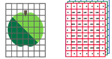

<context>
Door gebruik te maken van computervisie kunnen we verschillende objecten in een afbeelding of video lokaliseren en met behulp van classificatietechniek ook identificeren. Dit maakt het onder andere mogelijk om de toestand van tomaten te detecteren. Met behulp van het YOLO-algoritme is het mogelijk om zo rotte en goede tomaten automatisch van elkaar te onderscheiden. 

</context>
<decomposition>
Om dit probleem op te lossen maken we gebruik van het YOLO-algoritme. In dit geval willen we een eigen dataset samenstellen die gebruikt kan worden om te toestand van tomaten te identificeren. Om het algoritme te gebruiken moeten we dus enkele stappen doorlopen (**decompositie**):
<ol>
    <li>Foto's van tomaten verzamelen en labelen en zo een dataset samenstellen.</li>
    <li>Yolo-algoritme trainen met behulp van onze dataset.</li>
    <li>Testen van het algoritme met testafbeeldingen/foto's van een webcam.</li>
</ol> 
</decomposition>
<patternRecognition>
Zodra we de toestand van tomaten kunnen detecteren, is het ook mogelijk om hetzelfde proces opnieuw te doorlopen om bijvoorbeeld goede van rotte peren te onderscheiden (**patroonherkenning**). Maar denk gerust verder dan landbouw-gerelateerde concepten, computervisie wordt tegenwoordig op heel wat verschillende plaatsen gebruikt in de maatschappij. Denk bijboorbeeld aan het controleren van al dan niet perfecte medicatie op een productielijn in de farmaceutica, of het ontdekken van fysieke onderdelen in een machine die onderhoud nodig hebben. 
</patternRecognition>
<abstraction>
Een computer werkt binair: een computer zal dus geen afbeelding te zien krijgen zoals wij die zien, maar wel allemaal getallen. Een afbeelding bestaat uit pixels. Iedere pixel heeft een bepaalde kleur; die kleur kan worden voorgesteld door een getal. De computer maakt dus een abstractie van de afbeeldingen, net zoals in dit voorbeeld met een appel.  

 
Hoe bieden we tomaten aan de computer aan? Digitale foto's zijn eigenlijk rasters van getallen. Een kleurenfoto wordt bv. voorgesteld door RGB-codering: de voorstelling bestaat uit 3 tabellen van getallen, één voor de rood-, één voor de groen- en één voor de blauwtinten; elk drietal (R,G,B) komt overeen met één pixel. De computer maakt dus een **abstractie** van de afbeeldingen. 
</abstraction>
<algorithms>
Om dit probleem op te lossen maken we gebruik van het **YOLO-algoritme**. Een gedetailleerde beschrijving, kun je terugvinden in het <a href="/learning-path.html?hruid=agri_landbouw&language=nl&te=true&source_page=%2Fagriculture%2F&source_title=%20AI%20in%20de%20Landbouw#agri_tomaten;nl;3"><strong> leerpad AI in de landbouw - Deep learning</strong></a>.
</algorithms>
<implementation>
Een implementatie om tomaten te herkennen met behulp van computervisie kun je terugvinden in het <a href="/learning-path.html?hruid=agri_landbouw&language=nl&te=true&source_page=%2Fagriculture%2F&source_title=%20AI%20in%20de%20Landbouw#agri_tomaten;nl;3"><strong> leerpad AI in de landbouw - Deep learning</strong></a>.
</implementation>

