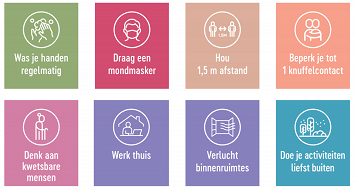
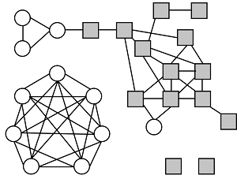
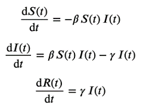

<context>
 
*Buitenplan 5 maart 2021*. Afbeelding © NCCN, Brussel, België.

Kunnen we het effect van de COVID-19-maatregelen inschatten voordat we ze invoeren?

</context>
<decomposition>
We identificeren 3 deelproblemen (**decompositie**):
1. Model voor verspreiding
2. Menselijke interacties voorstellen 
3. Simuleren van de verspreiding a.d.h.v. het model
</decomposition>
<patternRecognition>
De verspreiding van de pest, cholera, COVID-19 ... gedraagt zich gelijkaardig. We onderscheiden daarbij: vatbare individuen, geïnfecteerden en resistente individuen. (**patroonherkenning**)  
Interacties tussen mensen kunnen we op dezelfde manier voorstellen als verbindingen tussen steden (wegen), nl. met een graaf. (**patroonherkenning**)
</patternRecognition>
<abstraction>
We stellen de interacties tussen de mensen **abstract** voor door een graaf.
    
De evoluties in de aantallen vatbare individuen, geïnfecteerden en resistente individuen worden **abstract** voorgesteld door differentiaalvergelijkingen.  

</abstraction>
<algorithms>
Stappenplan (**algoritme**):
1. Definieer het SIR-model door een stelsel van differentiaalvergelijkingen (zoals links)
2. Kies samenstelling van de beginpopulatie
3. Kies het infectiepercentage
4. Kies het herstelpercentage
5. Kies een tijdsinterval
6. Los het stelsel numeriek op
</algorithms>
<implementation>
Voor het programma: zie de notebooks in leerpad 'Epidemie'.
</implementation>

