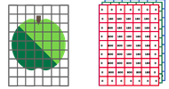
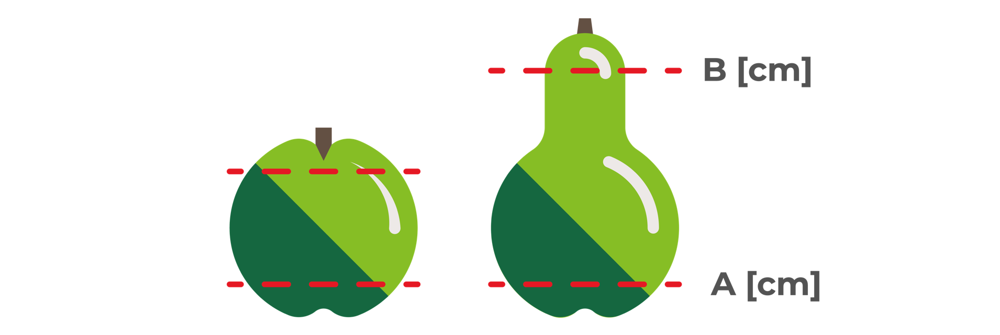
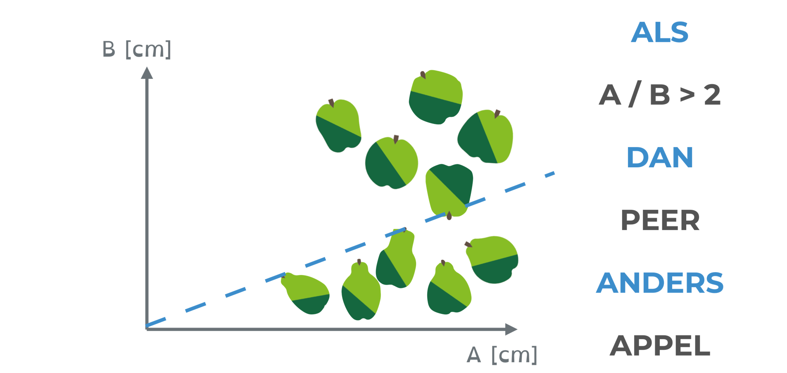

<context>

Probleem: Stel een algoritme op om een computer a.d.h.v. regels appels en peren van elkaar te laten onderscheiden. 

</context>
<decomposition>
Dit probleem kunnen we bijvoorbeeld opsplitsen in twee deelproblemen (**decompositie**):
<ol>
    <li>Op welke manier kan een stuk fruit aan de computer gegeven worden (*representatie*)?</li>
    <li>De computer moet voor een stuk fruit beslissen of het een appel of een peer is (*classificatie*).</li>
</ol>
</decomposition>
<patternRecognition>
Iets aanbieden aan de computer gebeurt steeds digitaal, d.w.z. door getallen te gebruiken. Zowel beeld, geluid als tekst worden omgezet naar een digitale vorm. (**patroonherkenning**) 
Objecten classificeren komt voor in tal van contexten. In deze verschillende contexten worden vaak gelijksoortige oplossingen toegepast, zoals diepe neurale netwerken (een artificieel intelligente techniek voor dit doeleinde). Beseffen dat een gekende oplossing ook toepasbaar is in een nieuwe context, is **patroonherkenning**.
</patternRecognition>
<abstraction>

Hoe bieden we appels en peren aan aan de computer? Digitale foto's zijn eigenlijk rasters van getallen. Een kleurenfoto wordt bv. voorgesteld door RGB-codering: de voorstelling bestaat uit 3 tabellen van getallen, één voor de rood-, één voor de groen- en één voor de blauwtinten; elk drietal (R,G,B) komt overeen met één pixel. (**abstractie**) 
A.d.h.v de waarden van de getallen kan de computer bv. de rand van het stuk fruit detecteren. 
</abstraction>
<algorithms>
Werk je met driedimensionale voorstellingen van de stukken fruit, bv. met 3D-scans, dan kunnen afmetingen van het stuk fruit bepaald worden: de omtrek A op 2 cm van de onderkant en de omtrek B op 2 cm van de bovenkant. 

Op basis van deze twee getallen kan je een **algoritme** opstellen waarmee een computer appels en peren kan onderscheiden.

</algorithms>
<implementation>
Geen implementatie. In dit voorbeeld wordt er niet geprogrammeerd.
</implementation>
