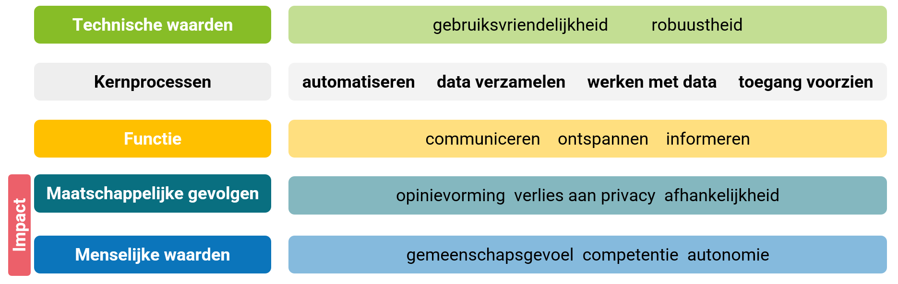

# Profilering via sociale media

Socialemediaplatformen stellen van hun gebruikers een persoonlijkheidprofiel op. 
Dat profiel kan bv. de interesses, de opinies, de natuur en de voorkeuren van iemand bevatten. 
Het gebruik van een persoonlijkheidprofiel kan op meerdere manieren een impact hebben op de gebruikers van het platform. Gepersonaliseerde reclame is er een voorbeeld van. 

**Impact: gepersonaliseerde reclame** 
Bedrijven bestuderen socialemediaposts om een idee te krijgen van iemands persoonlijkheid. Vervolgens proberen ze, gebruikmakend van die informatie, de gebruiker te overtuigen om tot een bepaalde aankoop over te gaan. Het is een manier om reclame te personaliseren. Zo komt men ertoe diensten en producten aan te bevelen a.d.h.v. aanbevelingsalgoritmes. Aanbevelingsalgoritmes kunnen een sterke invloed uitoefenen op het online shopgedrag (e-commerce). 

## Principes van computationeel denken

## Kader

## Bespreking van de impact

- **Mogelijkheid tot veel dataopslag**: Posts op sociale media worden door het betreffende platform zorgvuldig bijgehouden en blijvend gelinkt aan de gebruiker. Behalve de socialemediaposts worden ook het koop- en klikgedrag opgeslagen.

 - **Patronen**: Zowel de de socialemediaposts als het koop- en klikgedrag van een een gebruiker worden gebruikt om een persoonsprofiel op te maken van die persoon. Aanbevelingsalgoritmes doen aanbevelingen die bv. gebaseerd zijn op bepaalde **patronen** die aanwezig zijn in het klik- en koopgedrag van de gebruiker. Ook op basis van het koop- en klikgedrag van **gebruikers met ‘verwante’ interesses** wordt de ervaring op het socialemediaplatform gepersonaliseerd. 
Aan iemands socialemediaposts kan men de interesses en de opinies van de auteur achterhalen, en misschien zelfs de natuur en de voorkeuren van die persoon. Taalgebruik hangt daar immers mee samen. 

> Persoonlijkheid kan worden bekeken volgens het Vijf Factor Model, waarbij de kenmerken ‘extravert’, ‘aangenaam’, ‘zorgvuldig’, ‘neurotisch’ en ‘open voor ervaring’ beschouwd worden (Schwartz et al., 2013). Taalgebruik hangt samen met geslacht, leeftijd, en persoonskenmerken zoals introvert of extravert zijn (Schwartz et al., 2013; De Gussem & Daelemans, 2020). Zo zijn sommige woorden en woordengroepen meer typerend voor bepaalde leeftijdsgroepen, zoals ‘huiswerk’ voor tieners en ‘familie en vrienden’ voor volwassenen, en zijn er specifieke onderwerpen waarover men op Facebook schrijft, zoals ‘familie’ bij vrouwen en ‘xbox’ bij mannen. Extraverte personen gebruiken langere woorden dan introverte personen, en veel adjectieven.
Schwartz et al. illustreren dit met enkele woordenwolken die ze hebben opgesteld a.d.h.v. Facebookposts die ze hebben geanalyseerd (zie Figuur 1 voor de tieners). Schwartz et al. gebruikten een dataset van 15 miljoen Facebookberichten van 75 000 vrijwilligers. De cluster in het midden bevat de woorden die typerend zijn voor de groep: hoe groter het woord, hoe meer typerend; hoe donkerder het woord, hoe frequenter. De clusters errond tonen de typerende onderwerpen van Facebookberichten.
>  
> 
Figuur 1: Meest typerende woorden en onderwerpen voor tieners op Facebook (Schwartz et al., 2013).

 - **Algoritmes:** Met *natural language processing* (NLP), dus door het verwerken van natuurlijke taal, gaat men bijvoorbeeld in teksten op sociale media na of mensen zich positief of negatief uitlaten over bepaalde producten of bedrijven. *Aanbevelingsalgoritmes* leiden ertoe dat gebruikers gepersonaliseerde recklame krijgen. 

#### Bronnen
De Gussem, J. & Daelemans, W. (2020). Ben je wat je schrijft? *EOS Psyche & Brein Special*, (pp. 40–43). 
Schwartz, H., Eichstaedt, J., Kern, M., Dziurzynski, L., Ramones, S., Agrawal, M., Shah, A., Kosinski, M., Stillwell, D., Seligman, M., & Ungar, L. (2013). Personality, Gender,
and Age in the Language of Social Media: The Open-Vocabulary Approach. *PLOS ONE, 8*(9).

-------------------------------
## Gerelateerde voorbeelden: 

Aan de hand van het profiel van de gebruiker op bv. nieuwssites wordt ook gepersonaliseerd nieuws aan die gebruiker aangeboden.  
Omdat aanbevelingsalgoritmes ook steeds meer gebruikt worden op **websites van online kranten** en ook het resultaat van een **zoekmachine** steeds meer gepersonaliseerd wordt, is men best alert voor de **filterbubbel**. Als men onderhevig is aan een filterbubbel kan het beeld dat men heeft van de wereld misvormd zijn. Als men bv. wil leren over een onderwerp waar men niet vertrouwd mee is, dan kan men door zo’n bubbel een ongenuanceerd beeld krijgen.

Voor **human resources** is de persoonlijkheid van een sollicitant een interessant gegeven, sommige types zijn immers beter geschikt voor een bepaalde functie dan andere (De Gussem & Daelemans, 2020). 
Het Gentse bedrijf Traicie werkt aan een AI-systeem dat op basis van **sollicitatiebrieven** beslist in welke mate de auteur over de vaardigheden beschikt vereist voor een bepaalde job. Het systeem leidt daartoe persoonlijkheidskenmerken af uit wat de sollicitant schreef en zegt daarvoor een *unbiased* systeem te gebruiken.

Het bestuderen van socialemediaposts van een gebruiker wordt ook gebruikt om in te schatten voor wie die zou stemmen bij een aankomende **verkiezing**. 

Ook **banken** houden rekening met de persoonlijkheid van een klant, bijvoorbeeld in het kader van het toekennen van een lening.

Aanbevelingsalgoritmes op Netflix. 

Aanbevelingsalgoritmes bij online shopping zoals op Amazon, bol, coolblue en Zalando.  

Aanbevelingsalgoritmes op sociale media zoals 'wie te volgen' op Twitter.

-------------------------------
#### Leestips 

Lees meer over de [filterbubbel](https://dwengo.org/backend/api/learningObject/getWrapped?hruid=cb_6002&version=3&language=nl) in het leerpad [Journalistiek](https://dwengo.org/learning-path.html?hruid=cb6&language=nl&te=true&source_page=%2Fchatbot%2F&source_title=%20Chatbot#cb_6000;nl;3) van het [project over taaltechnologie](https://dwengo.org/chatbot/).  

De Gussem, J. & Daelemans, W. (2020). Ben je wat je schrijft? *EOS Psyche & Brein Special*, (pp. 40–43).

[De Volkskrant - 24/22/2018 - Geld lenen? Dan worden eerst je social media-accounts gescreend](https://www.volkskrant.nl/nieuws-achtergrond/geld-lenen-dan-worden-eerst-je-social-media-accounts-gescreend~b53b4a36/)

#### Kijktips 

Bekijk de [video](https://trends.knack.be/kanaal-z/z-nieuws/taalgebruik-op-cv-onthult-persoonlijkheid/).
Bezoek ook de website van [traicie](https://traicie.com/) en bespreek de objectiviteit van het systeem.
