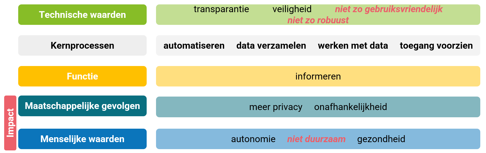

# Zwangerschapstest

Op de markt zijn zwangerschapstesten zowel in niet-digitale als in digitale vorm te vinden. Fabrikanten van zwangerschapstesten rekenen er misschien op dat mensen ervan uitgaan dat een digitale versie van de zwangerschapstest beter is dan een niet-digitale versie. Door een digitale versie aan te bieden verhogen ze mogelijk hun winstmarge, want die digitale versie is aanzienlijk duurder dan de niet-digitale zwangerschapstest. 

**Impact: zwangerschapstest** 
Een mogelijke impact is dat mensen meer geld uitgeven dan nodig.

Maar om dat te kunnen besluiten, vergelijk je best de werking van beide systemen om te kunnen nagaan of het ene systeem meer voordelen of nadelen heeft dan het andere. 

> **Leestips:** 

## Principes van computationeel denken

## Kader impact op de maatschappij

## Bespreking van de impact

-------------------------------
## Gerelateerde voorbeelden: 

-----------------------------
### Werking 

-----------------------------
#### Leestips

#### Kijktips

