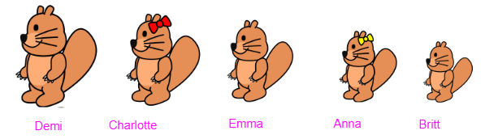
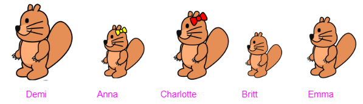

# Voorbeeld 1:  Decompositie en abstractie
Bron: [het online platform van de Belgische Bebras-wedstrijd](https://bebras.ugent.be/) 
Tekst: Pär Söderhjelm, SE, Artem Iglikov, KZ, Jan Berki, CZ 
Afbeeldingen: Maiko Shimabuku, JP 
Vertaling: Kris Coolsaet 

## Groter en kleiner (Bebras 2014-SE-04)

De jonge bevers Anna, Britt, Charlotte, Demi en Emma - allemaal met een verschillende lengte - willen met jou een spelletje spelen. Ze plaatsen zich in een rij, de ene achter de andere, terwijl ze allemaal in dezelfde richting kijken, in een volgorde die ze zelf hebben gekozen. Elke bever telt dan hoeveel bevers vóór en achter haar groter zijn. Dit zijn de resultaten:

|**Naam**|**Aantal grotere bevers ervoor**|**Aantal grotere bevers erachter**|
|---------------|------------------------|----------------------------|
|Anna|1|2|
|Britt|3|1|
|Charlotte|1|0|
|Demi|0|0|
|Emma|2|0|

*In welke volgorde staan de bevers opgesteld?*

#### Oplossing

Er zijn 5 bevers.  
Uit de tabel kan je afleiden dat Demi de grootste is want geen enkel bever ervoor of erachter is groter. Daarna volgt Charlotte met slechts één bever die groter is (nl. Demi), dan Emma, en dan Anna en tot slot Britt. Britt is de kleinste bever want alle vier de andere bevers zijn groter.

Redeneer nu op de volgende manier: 
- Omdat iedereen kleiner is dan Demi, is Demi groter dan Charlotte, en moet het Demi zijn die voor Charlotte in de rij staat.   
    - Demi - Charlotte
- Er zijn twee bevers groter dan Emma en die staan voor Emma. Die twee bevers zijn Demi en Charlotte  
    - Demi - Charlotte - Emma
- Omdat slechts één grotere bever voor Anna staat, moet dat Demi zijn. Dus Anna komt na Demi en voor Charlotte en Emma. 
    - Demi - Anna - Charlotte - Emma
- Britt heeft drie grotere bevers voor zich staan, dus staat Britt na Charlotte in de rij. 
    - Demi - Anna - Charlotte - Britt - Emma

#### Bespreking

Dit is een mooi voorbeeld van **decompositie**. In een eerste stap bepaal je voor elke bever hoeveel bevers kleiner zijn dan die bever en dus eigenlijk wat de rangschikking in grootte van de bevers is. Daarna gebruik je deze informatie in een tweede stap om de volgorde van de bevers in de rij te bepalen. 

Bij de oplossing pak je de deelproblemen een voor een aan. Op die manier bekom je telkens tussenresultaten die je dan gebruikt om een volgend deelprobleem op te lossen.

In de eerste stap maak je bovendien een **abstractie** van het verschil tussen ‘ervoor’ en ‘erachter’. Je bent enkel geïnteresseerd in het aantal bevers die groter zijn dan een bepaalde bever, niet of die ervoor of erachter staan.
