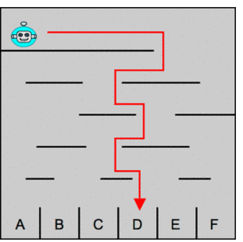

# Voorbeeld 2:  Algoritme toepassen
Bron: [het online platform van de Belgische Bebras-wedstrijd](https://bebras.ugent.be/) 
Tekst: Mathias Hiron, FR 
Afbeeldingen: onbekend 
Vertaling: Kris Coolsaet 

## Naar beneden (Bebras 2012-FR-10)
Mevrouw Bever heeft een robot geplaatst bovenaan een doolhof. De robot daalt het doolhof af van het ene platform naar het andere eronder, totdat hij één van de vakken bereikt helemaal onderaan. Hiebij verplaatst hij zich altijd op dezelfde manier: hij verplaatst zich eerst naar rechts, en telkens wanneer hij een platform naar beneden valt, vertrekt hij opnieuw in de omgekeerde richting.

De linker afbeelding hieronder toont het traject dat de robot zal volgen in het doolhof nr. 1.

*Als mevrouw Bever haar robot helemaal links plaatst in doolhof nr. 2, in welk vak zal de robot dan uiteindelijk vallen?*

##### Oplossing

Je vindt de oplossing door het **algoritme** uit te voeren dat is opgegeven.

##### Bespreking

De robot verplaatst zich volgens een gegeven **algoritme**. Dat algoritme moet je begrijpen en toepassen op het tweede doolhof. 

Het algoritme kan als volgt beschreven worden: 

Herhaal de volgende vier lijnen, zolang je niet beneden bent aangekomen: 
&nbsp;&nbsp;&nbsp;&nbsp;Ga verder in de huidige richting, en daarna 
&nbsp;&nbsp;&nbsp;&nbsp;&nbsp;&nbsp;&nbsp;&nbsp;Val naar beneden tot aan het eerstvolgende platform, en 
&nbsp;&nbsp;&nbsp;&nbsp;&nbsp;&nbsp;&nbsp;&nbsp;Keer de huidige richting om

Er zijn verschillende manieren om algoritmisch denken in een computationeel denkproces toe te passen. In dit voorbeeld komt algoritmisch denken voor in zijn eenvoudigste vorm is. In de andere voorbeelden maak je kennis met andere vormen van algoritmisch denken.

Mogelijke toepassingen zijn:
- een opgegeven algoritme kunnen toepassen (voorbeeld 2, voorbeeld 4);
- zelf een algoritme bedenken om op een efficiënte manier tot een oplossing te komen (voorbeeld 5).

Een tussenweg waarvan er hier (nog) geen voorbeeld is:  
- een (algemeen) gekend algoritme toepassen om een probleem op te lossen. 
Bij deze tussenweg is een vorm van patroonherkenning nodig. Voorbeelden ervan zijn: weten hoe je geld moet teruggeven om zo weinig mogelijk briefjes en munten te gebruiken, een lineaire
vergelijking met één variabele kunnen oplossen ...
