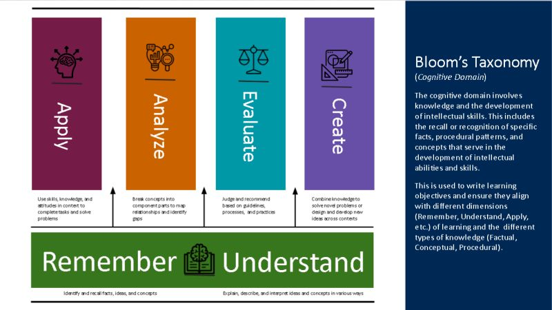
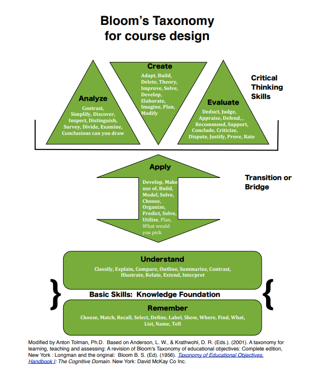
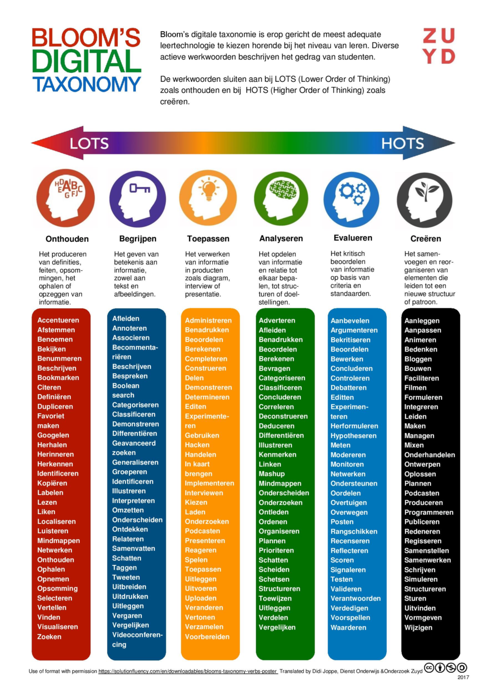
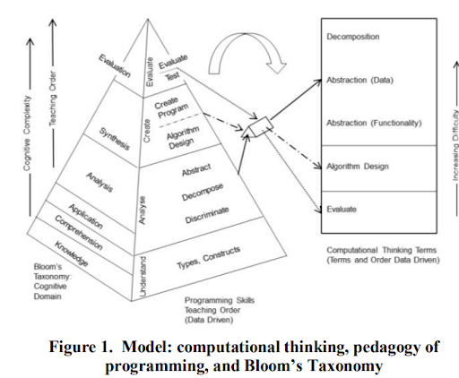
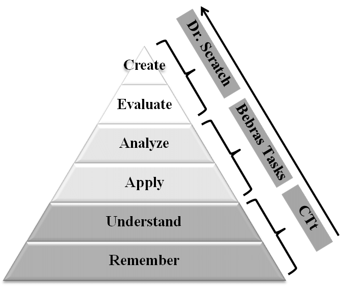

# Handelingswerkwoord

Elke eindterm en ieder minimumdoel zijn geformuleerd a.d.h.v. een handelingswerkwoord. Het heeft een indicatie van het beheersingsniveau waarop leerlingen moeten geëvalueerd worden. De handelingswerkwoorden houden echter geen sluitende hiërarchie in.  

## Handelingswerkwoorden voor digitale competenties

De herwerkte taxonomie van Bloom beschrijft zes categorieën van ‘leren’: onthouden, begrijpen, toepassen, analyseren, evalueren en creëren. De taxonomie kan een houvast bieden bij het evalueren van leerlingen. 

> In de vernietigde eindtermen werd het beheersingsniveau meegegeven a.d.h.v. de herwerkte taxonomie van Bloom. In de huidige minimumdoelen werd afgestapt van de taxonomie, maar de handelingswerkwoorden zijn wel overeind gebleven. 
Voor meer uitleg over de herwerkte taxonomie van Bloom zie ‘A taxonomy for learning, teaching, and assessing: A revision of Bloom’s taxonomy of educational objectives’ van Anderson en Krathwohl (2001).

 
Herwerkte taxonomie van Bloom, deze houdt geen hierarchie in. [1]

Nog een andere voorstelling: 
 
DrAntonT, CC BY-SA 4.0, via Wikimedia Commons.

Misconceptie: De categorieën van de taxonomie van Bloom houden een hiërarchie in. 
*Deze misconceptie wordt mede in stand gehouden omdat ze vaak worden voorgesteld in een piramide/driehoek.*

Om de categorie van een leerdoel vast te leggen, specifiek voor de digitale competenties, kan je gebruikmaken van een van de handelingswerkwoorden die in de volgende afbeelding verzameld zijn. Je kan ze ook gebruiken om het beheersingsniveau te bepalen van een evaluatie. 
 
Werkwoorden in het kader van de taxonomie van Bloom, geschikt voor gebruik in een digitale context. [2]

## Computationeel denken

### Programmeren

Cynthia Selby (2015) koppelde de zes categorieën van ‘leren’ - onthouden, begrijpen, toepassen, analyseren, evalueren en creëren - aan vijf basisconcepten van computationeel denken,  nl. decompositie, abstractie, algoritme, generalisatie en evaluatie.  
Ze ging ook na hoe moeilijk leerkrachten bepaalde concepten van computationeel denken percipiëren binnen een context van programmeren. 
> Decompositie wordt als het moeilijkst ervaren.  
In een programmeeropdracht is decompositie het eerste dat men doet. Het feit dat dit als heel moeilijk wordt ervaren, wordt best in rekening gebracht vanuit pedagogisch oogpunt.

De ‘mapping’ en het resultaat van dat onderzoek worden voorgesteld in de volgende figuur. 
 
Model voor computationeel denken, didactiek van programmeren, en de taxonomie van Bloom (Selby, 2015). We zijn niet akkoord met de
aangegeven orde van complexiteit en de volgorde waarin bepaalde items aan bod komen in de les; rest is wel waardevol.

Ramon-Gonzalez et al. geven aan dat het evalueren van computationeel denken niet mogelijk is met een enkele evaluatievorm. In tegendeel, je moet verschillende evaluatievormen gebruiken die elkaar aanvullen. 

 
Bloom’s taxonomy and CT assessment tools. [3]

### Unplugged activiteiten

Behalve programmeren werden ook de ‘CS Unplugged’-activiteiten al eens gespiegeld aan het kader van Bloom. Bell & Vahrenhold (2018) kwamen tot de bevinding dat enkel unplugged activiteiten niet volstaan om alle categorieën van het kader aan bod te laten komen.

-------------------------------------
#### Bronnen
Bell, T. & Vahrenhold, J. (2018). CS Unplugged - How Is It Used, and Does It Work? *Adventures Between Lower Bounds and Higher Altitudes*. 
[1] Clark, D. *Bloom (1913-1999) - Mastery learning. Taxonomy of learning… not a hierarchy…* [Blogpost]. http://donaldclarkplanb.blogspot.com/2020/03/bloom-1913-1999-taxonomy-of-learning.html 
[2] Werkwoorden in het kader van de taxonomie van Bloom, geschikt voor gebruik in een digitale context. https://digitaledidactiek.zuyd.nl/leerdoelen/ 
[3] Román-González, M., Moreno-León, J., & Robles, G. (2017). Complementary Tools for Computational Thinking Assessment.  
Selby, C. (2015). Relationships: computational thinking, pedagogy of programming, and Bloom’s Taxonomy. *Proceedings of the Workshop in Primary and Secondary Computing Education*, (pp. 80–87).
