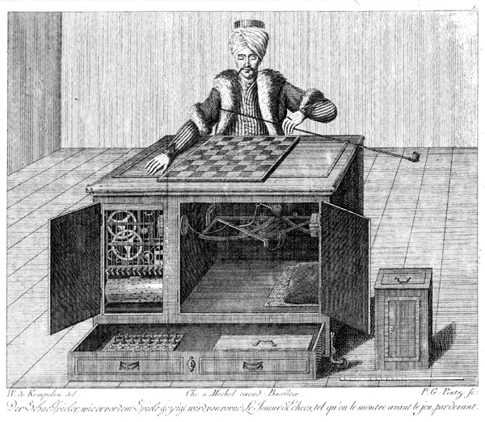

# Robots en AI

Nadenken over automatisatie en kunstmatige intelligentie is van alle tijden. Homeros (ongeveer 800 jaar voor Christus) beschreef in de Ilias automatische hemelpoorten en in de Odyssee artificieel intelligente schepen. Maar deze werken illustreren ook de eeuwenoude fascinatie om dierlijk en menselijk gedrag te imiteren. Homeros schrijft over de gouden dienstmeisjes van Hephaistos, die eigenlijk een soort van zorgrobots waren, zijn automatische tripods die de goden konden dienen, alsook de gouden en zilveren honden die het paleis van Alkinoos moesten bewaken en onsterfelijk waren (Kalligeropoulos & Vasileiadou, 2008; Kline, 2004, 2009). 

> Het woord ‘automata ( αυτ ó µατα )’ komt van Homeros; het komt voor in de Ilias en de Odyssee. Het betekent ‘uit zichzelf’. Homeros beschrijft er machines van Hephaistos mee die uit zichzelf kunnen bewegen (Kalligeropoulos & Vasileiadou, 2008). 

Automatisatie bleef dus niet beperkt tot het **ontwerpen van machines**, maar mensen gingen ook op zoek naar manieren om **dierlijk en menselijk gedrag te imiteren**. Ismail Al-Jazari schreef in 1206 een boek waarin hij de indrukwekkende automaten beschreef die hij ontwierp, waaronder een boot met vier automatische muzikanten. Dan zijn er nog de ‘humanoïde robot’ die Leonardo da Vinci op het einde van de 15de eeuw ontwierp (maar vermoedelijk nooit realiseerde) en de mechanische eend van Jacques de Vaucanson uit de 18de eeuw die de vertering van voedsel simuleerde. De automaten waren een eerste aanzet tot de huidige robots. 

> [De 'Mechanische Turk' (video)](https://youtu.be/N4ccP8MwR50https://youtu.be/MCW_wp0dgF4)  
> [Robot Leonardo Da Vinci](https://nl.wikipedia.org/wiki/Leonardo_da_Vinci%27s_robot)  
> [Mechanische eend](https://klara.be/de-mechanische-eend-van-jacques-de-vaucanson)  
> [Mechanische eend (video)](https://youtu.be/9KiDQLb33gg)

Tevens in de 18de eeuw moest de Mechanische Turk (zie Figuur 2.1) de mensen laten geloven dat men een machine uitgevonden had die kon schaken; de Mechanische Turk bleek je reinste bedrog - er zat een mens in - maar illustreert wel de wens om ook het menselijk denken te kunnen nabootsen. 

 
<figure>
    <figcaption align = "center"><b>Kopergravure van de Mechanische Turk met open kastdeuren (von Windisch, 1783)</b></figcaption>
</figure>

De dag van vandaag vertaalt zich dit in de ontwikkeling van de **artificiële intelligentie** (AI), waaronder de zoektocht naar AGI (artificial general intelligence). AI-systemen zijn al op verschillende domeinen actief, bv. ter ondersteuning van een radioloog bij het beoordelen van medische beelden. Maar een mogelijke motivatie voor het inzetten van AI kan ook als volgt zijn: als mensen beslissingen nemen, dan zijn die niet altijd gebaseerd op objectieve overwegingen. Een ogenschijnlijk objectief toestel, zoals een computer, beslissingen laten nemen, lijkt dus een aanlokkelijk idee. 

--------------------
#### Bronnen

Kalligeropoulos, D. & Vasileiadou, S. (2008). *The Homeric Automata and Their Implementation*, (pp. 77–84). Dordrecht: Springer Netherlands. 
Kline, A. (2004). *Homer: The Odyssey Book VII.* Poetry in Translation. Geraadpleegd op 11 augustus 2022 via https://www.poetryintranslation.com/PITBR/Greek/Odyssey7.php 
von Windisch, K. (1783). *Copper engraving from the book: Karl Gottlieb von Windisch, Briefe über den Schachspieler des Hrn. von Kempelen, nebst drei Kupferstichen die diese berühmte Maschine vorstellen*. [Afbeelding]. Geraadpleegd op 26 mei 2022 via https://commons.wikimedia.org/w/index.php?curid=424092
