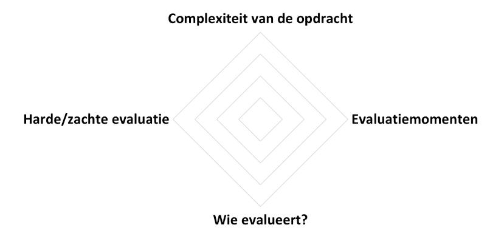

# Kader

## Wat wil je met computationeel denken bij leerlingen bereiken?

**Digitaal inzicht** 
Je wil dat leerlingen zowel weten hoe ze een digitaal systeem moeten gebruiken, alsook de onderliggende principes van digitale systemen begrijpen.

**Decompositie** 
Je wil dat leerlingen een probleem doordacht opsplitsen in goedgekozen deelproblemen, zodat elk deel afzonderlijk kan worden aangepakt, en een oplossing van het probleem gemakkelijker bekomen wordt.

**Abstractie** 
Je wil dat leerlingen informatie negeren die niet nodig is om een probleem op te lossen en dat ze bepaalde details verbergen om in grote lijnen over een probleem te kunnen nadenken. Want bij het aanpakken van complexe problemen is er nood aan abstractie omdat het redeneren vlotter verloopt zonder de ballast van irrelevante details.

**Patroonherkenning** 
Je wil dat leerlingen achterhalen dat bepaalde aspecten van een probleem gelijkenissen vertonen, waardoor het vereenvoudigd kan worden en/of dat ze herkennen dat een probleem gelijkenissen vertoont met een eerder opgelost probleem.

**Algoritmisch denken** 
Je wil dat leerlingen een reeks eenduidige instructies, die stapsgewijs moeten worden uitgevoerd, expliciteren en dat ze inzien dat deze reeks van instructies en de volgorde ervan essentieel zijn om het gewenste resultaat op te leveren.

**Testen en debuggen** 
Je wil dat leerlingen een oplossing testen en evalueren of hun oplossingen werken zoals bedoeld, en dat ze eventuele fouten kunnen vinden, begrijpen en verbeteren.

**Generaliseren** 
Je wil dat leerlingen proberen om een nieuw probleem op te lossen door een eerdere oplossing of een variant ervan toe te passen. 

**Ethisch en maatschappelijk bewustzijn** 
Je wil dat leerlingen reflecteren over de ethische en maatschappelijke implicaties van technologie en digitale oplossingen.

**Creativiteit** 
Je wil dat leerlingen zowel bestaande methoden volgen, alsook nieuwe manieren zoeken om problemen op te lossen. 

**Doorzettingsvermogen** 
Je wil dat leerlingen bij het oplossen van problemen de vastberadenheid hebben om door te gaan, verschillende benaderingen proberen en leren uit hun fouten.

**Logisch denken** 
Je wil dat leerlingen wat ze geleerd hebben in logica in wiskunde toepassen bij het ontwerpen van een algoritme.

**Modelleren en simuleren** 
Je wil dat leerlingen een wiskundig model ontwerpen en gebruiken om een bepaald fenomeen te simuleren. 

**Data verzamelen, visualiseren en analyseren** 
Je wil dat leerlingen correct inschatten welke data geschikt zijn bij het aanpakken van een probleem, dat ze die data verzamelen, op een goede manier visualiseren en vervolgens analyseren en interpreteren. 

**Communiceren** 
Je wil dat de leerlingen over hun aanpak en oplossing van een probleem communiceren op een heldere manier, en de genomen keuzes argumenteren. 

## Hoe kan je je voorbereiden op het evalueren van computationeel denken? 

* Formuleer het onderwerp/de leeractiviteit.
* Noteer het onderwijsdoel/leerplandoel.
* Identificeer de concepten die je wil bereiken bij de leerlingen.
* Formuleer leerdoelen en vermeld desgewenst het beheersingsniveau van de taxonomie van Bloom.
* Formuleer leerlingenopdrachten.
* Leg de evaluatievormen vast.
* Vul de evaluatiefiche in via het sjabloon dat hierna aangereikt wordt.

## Sjabloon

We stellen een sjabloon voor dat kan gebruikt worden als 'evaluatievoorbereiding'.
Ja kan als leerkracht dit sjabloon gebruiken om over de evaluatie bij een bepaalde opdracht of een bepaald project na te denken.

Het sjabloon omvat vier elementen: 
- de complexiteit van de opdracht;
- evaluatiemomenten;
- harde en/of zachte evaluatie;
- wie er evalueert.
  
Bij deze elementen zijn er telkens vier mogelijkheden, genummerd van 1 t.e.m. 4 (dit houdt geen gradatie in).

||Complexiteit|Evaluatiemomenten|Harde/zachte evaluatie|wie evalueert?|
|--|------------|-----------------|----------------------|--------------|
|1|Eenvoudig|Eenmalige formatieve evaluatie|Product (harde evaluatie)|Leraar|
|2|Gemiddeld|Eenmalige summatieve evaluatie|Proces (zachte evaluatie)|Leraar en leerling|
|3|Complex|Meerdere formatieve evaluaties|Product & proces (zachte evaluatie) |Leraar, leerling en medeleerlingen|
|4|Uitdagend|Meerdere formatieve en summatieve evaluaties|Product & proces (combi harde en zachte evaluatie)|Leraar, leerlingen, medeleerlingen en anderen (ouders, externe jury ...).|

#### Complexiteit

De complexiteit van een opdracht hangt af van meerdere factoren, zoals: 
- de hoeveelheid kennis er vereist is,
- hoe vaardig men ergens moet in zijn en of er een nieuwe vaardigheid moet verworven worden,
- hoe creatief men moet zijn,
- de mate van zelfstandigheid dat er gevraagd wordt,
- hoe open of dubbelzinnig de opdracht is,
- hoeveel deelproblemen er moeten geïdentificeerd worden,
- ...

  
#### Evaluatiemomenten

Bij het vastleggen van het aantal evauatiemomenten leg je ook vast wanneer je formatief of summatief wilt evalueren.

- Een *formatief* evaluatiemoment houdt in dat er een opdracht wordt ingezet als een middel om feedback te bieden op het leerproces, voordat een definitieve beoordeling plaatsvindt. Zo'n evaluatiemoment ondersteunt in het bereiken van de leerdoelen: het focust op het identificeren van sterke en zwakke punten, waarop de leerling, indien nodig, het leerproces kan bijsturen, al dan niet samen met de leerkracht. Het betreft dus een *tussentijdse beoordeling* van de te evalueren leerdoelen in de vorm van een cijfer of tekstbeoordeling. Een formatief evaluatiemoment  kan zowel hard of zacht zijn. 
- Een *summatief* evaluatiemoment houdt in dat een opdracht wordt ingezet om een leerprestatie te beoordelen bij het aflsuiten van een leerperiode. Het betreft een *definitieve beoordeling* in de vorm van een cijfer of tekstbeoordeling. Een summatief evaluatiemoment kan zowel hard of zacht zijn.  
- *Feedback* kan evenwel niet alleen na het uitvoeren van een opdracht worden gegeven; een vorm van 'feedback' kan ook aan het begin en gedurende het uitvoeren van een opdracht. Je spreekt dan respectievelijk van *feed-up* en *feed-forward*. Dit bevordert de gerichtheid op leerdoelen. 
- In vergelijking met eenmalige evaluaties bieden meerdere evaluaties een meer betrouwbaar en consistent beeld van de prestaties van de leerling. Formatieve evaluaties stellen leerlingen in staat om hun prestaties te verbeteren door feedback en bijsturing van hun leerproces. Via meerdere evaluaties kunnen verschillende aspecten van een leerdoel, waaronder de diepgang, belicht worden.

#### Wie evalueert?

Bij een evaluatiemoment kan jij als leerkracht evalueren, maar de leerlingen kunnen ook elkaar evalueren of zichzelf. Ook de ouders of een externe jury kunnen betrokken worden. 

De keuze voor wie evalueert hangt af van:
- de te evalueren leerdoelen,
- hoe formeel de beoordeling is en hoe zwaar die doorweegt,
- het eigenaarschap van de leerlingen,
-  ...

#### Harde en zachte evaluatie

Bij dit element denk je na over harde en zachte evaluatie, en over proces- en productevaluatie. 
- Procesevaluatie en productevaluatie zijn twee verschillende soorten evaluatie om verschillende aspecten van het leerproces te beoordelen. In essentie beoordeelt procesevaluatie het leerproces zelf, terwijl productevaluatie het resultaat van dat leerproces beoordeelt.
- Harde evaluatie is kwantitatief en meetbaar, terwijl zachte evaluatie kwalitatief is en de subjectieve aspecten van leren belicht. 

#### De evaluatievormen

Je zal ook moeten nadenken over welke evaluatievormen je wil hanteren, zoals een individuele toets, een mondelinge opdracht, een werkstuk, een portfolio, zelfevaluatie, observatie, een exit ticket ... 

-----------------------

#### Bronnen en inspiratie #### 

- Bredere evaluatie: schuiven op vier assen, Katrien Bultynck, 2004.
- Toolkit breed evalueren. Harde of zachte evaluatie, Saveyn, J., 2007. https://data-onderwijs.vlaanderen.be/documenten/bestand.ashx?id=12568
- https://formatiefevalueren.kdg.be/ 
