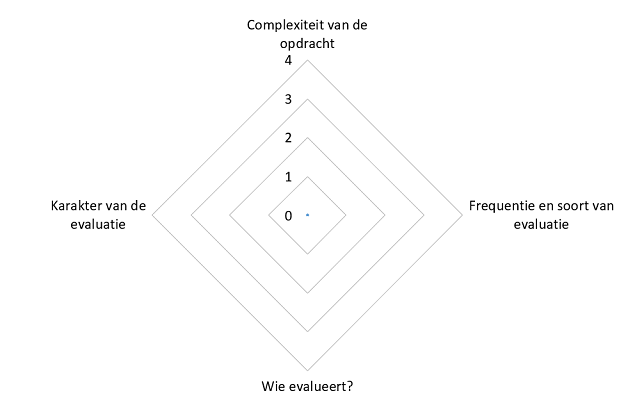

# Evaluatieaanpak

## Sjabloon

We stellen een sjabloon voor dat gebruikt kan worden als 'evaluatievoorbereiding'.
Als leerkracht kan je dit sjabloon gebruiken om over de evaluatie bij een bepaalde opdracht of een bepaald project na te denken.

Het sjabloon omvat vier elementen: 
- de complexiteit van de opdracht;
- de frequentie en het soort van evaluatie;
- het karakter van de evaluatie;
- wie er evalueert.
  

Bij deze elementen zijn er telkens vier mogelijkheden, genummerd van 1 t.e.m. 4 (dit houdt geen gradatie in).

||Complexiteit|Evaluatiemomenten|Karakter van de evaluatie|Wie evalueert?|
|--|------------|-----------------|----------------------|--------------|
|1|Eenvoudig|Eenmalige formatieve evaluatie|Product en kwantitatief|Leerkracht|
|2|Gemiddeld|Eenmalige summatieve evaluatie|Proces en kwalitatief|Leerkracht en leerling|
|3|Complex|Meerdere formatieve evaluaties|Product & proces, kwalitatief|Leerkracht, leerling en medeleerlingen|
|4|Uitdagend|Meerdere formatieve en summatieve evaluaties|Product & proces, combinatie van kwantitatief en kwalitatief|Leerkracht, leerlingen, medeleerlingen en anderen (ouders, externe jury ...)|

#### Complexiteit

De complexiteit van een opdracht hangt af van meerdere factoren, zoals: 
- hoeveel kennis er vereist is;
- hoe vaardig men ergens moet in zijn en of er een nieuwe vaardigheid verworven moet worden;
- hoe creatief men moet zijn;
- de mate van zelfstandigheid die er gevraagd wordt;
- hoe open of dubbelzinnig de opdracht is;
- hoeveel deelproblemen er geïdentificeerd moeten worden;
- ...

  
#### Evaluatiemomenten

Bij het vastleggen van het aantal evaluatiemomenten leg je ook vast wanneer je formatief of summatief wilt evalueren.

* Een *formatief* evaluatiemoment houdt in dat er een opdracht wordt ingezet als een middel om feedback te bieden op het leerproces, voordat een definitieve beoordeling plaatsvindt. Zo'n evaluatiemoment ondersteunt leerlingen in het bereiken van de leerdoelen: het focust op het identificeren van sterke en zwakke punten, waarop de leerling, indien nodig, het leerproces kan bijsturen, al dan niet samen met de leerkracht. Het betreft dus een *tussentijdse beoordeling* van de te evalueren leerdoelen in de vorm van een cijfer of tekstbeoordeling. Een formatief evaluatiemoment kan zowel kwantitatief als kwalitatief zijn. Formatief verwijst dus niet naar de vorm van evaluatie; het sluit ook geen toetsen uit. Formatief refereert aan de aard van de beslssing die de leerkracht en de leerling neemt op basis van het resultaat van de evaluatie (Sluijsmans, 2020). Formatieve evaluatie kan bv. over een beperkt onderdeel van de leerstof gaan waarbij het mogelijk is om in de diepte te testen (Weintrop et al., 2021).

* Een *summatief* evaluatiemoment houdt in dat een opdracht wordt ingezet om een leerprestatie te beoordelen bij het aflsuiten van een leerperiode. Het betreft een *definitieve beoordeling* in de vorm van een cijfer of tekstbeoordeling. Een summatief evaluatiemoment kan zowel kwantitatief als kwalitatief zijn. Summatieve evaluatie vindt vaak plaats op het einde van een leerstofonderdeel en test daarom dikwijls een breed spectrum van competenties (Weintrop et al., 2021).

* *Feedback* kan evenwel niet alleen na het uitvoeren van een opdracht worden gegeven. Een vorm van 'feedback' kan ook aan het begin en gedurende het uitvoeren van een opdracht; je spreekt dan respectievelijk van *feed-up* en *feed-forward*. Dit bevordert de gerichtheid op leerdoelen. 

* In vergelijking met eenmalige evaluaties bieden meerdere evaluaties een meer betrouwbaar en consistent beeld van de prestaties van de leerling. Formatieve evaluaties stellen leerlingen in staat om hun prestaties te verbeteren door feedback en bijsturing van hun leerproces. Via meerdere evaluaties kunnen verschillende aspecten van een leerdoel, waaronder de diepgang, belicht worden.

#### Wie evalueert?

Bij een evaluatiemoment kan jij als leerkracht evalueren, maar de leerlingen kunnen ook elkaar evalueren of zichzelf. Ook de ouders of een externe jury kunnen betrokken worden. 

De keuze voor wie evalueert hangt af van: 
* de te evalueren leerdoelen;
* hoe formeel de beoordeling is en hoe zwaar die doorweegt;
* het eigenaarschap van de leerlingen;
*  ...

#### Karakter van de evaluatie

Bij dit element denk je na over proces- en productevaluatie, en of je kwantitatief of kwalitatief wil evalueren. 
- Procesevaluatie en productevaluatie zijn twee verschillende soorten evaluatie om verschillende aspecten van het leerproces te beoordelen. In essentie beoordeelt procesevaluatie het leerproces zelf, terwijl productevaluatie het resultaat van dat leerproces beoordeelt.
- Voor een kwantitatieve evaluatie moet je beschikken over meetbare gegevens. Om de eerder subjectieve aspecten van leren te belichten, kan je op een kwalitatieve manier evalueren.  

#### Spinnenwebdiagram

De kenmerken die de aanpak van de evaluatie uitdagend maken (zij het voor de leerling, zij het voor de leerkracht), bevinden zich het meest aan de buitenkant van 'het web'.

## De evaluatievormen

Je zal ook moeten nadenken over welke evaluatievormen je wil hanteren, zoals een individuele toets, een mondelinge opdracht, een werkstuk, een portfolio, zelfevaluatie, observatie, een exit ticket ... Om computationeel denken te evalueren zal je niet genoeg hebben aan en evaluatievorm. Je zal verschillende vormen moeten combineren (Roman-Gonzalez et al., 2019; Weintrop et a;., 2021).
In het volgende leerpadonderdeel bekijk je enkele vormen van dichterbij.

<strong><h5>Nadenken over evaluatie</h5></strong> 
Om de evaluatievorm te bepalen, moet je enkele elementen in acht nemen:
<ul>
    <li>welke leerdoelen, kennis of vaardigheden je juist wilt testen (Weintrop et al., 20210)</li>
    <li>de tijd die leerlingen voor de beoordeling krijgen
        <ul>
            <li>Dit zal voor een stuk bepalen hoe diepgaand de beoordeling kan zijn en hoeveel aspecten van computationeel denken er beoordeeld worden.</li>
        </ul>
    </li>
    <li>de manier waarop de beoordeling gebeurt
        <ul>
            <li>Is de context van de evaluatie gelijkend op de context van de les?<li>
            <li>Zullen de leerlingen een beroep moeten doen op technologie?</li>
            <li>Omgekeerd zal wat je wil evalueren ook mee bepalen of je kiest voor ondersteuning met technologie, dan wel een evaluatie met pen en papier.</li>
        </ul>
    </li>
</ul>
Al deze aandachtspunten bepalen mee welke evaluatie er geschikt is voor het gekozen doel. 

**Voorbeeld** 
Stel dat je abstractie wilt evalueren. Wil je dan dat leerlingen:
* uitleggen waarom abstracties nuttig zijn?
* een gegeven abstractie analyseren?
* een gegeven abstractie gebruiken?
* een abstractie maken?
* een oplossing voor een probleem ontwerpen en daarbij een abstractie gebruiken?

Stel dat je wil dat ze een abstractie maken: 
* Dan zal het type van abstractie en hoe moeilijk deze opdracht is, mee bepalen welke evaluatievorm je zal hanteren.
* De leeftijd van de leerlingen en het gewenste **beheersingsniveau** zal een rol spelen.
* Je zal ook moeten bepalen of je enkel 'abstractie' beoordeelt, of dat je ook **kennis uit een bepaalde context** verwacht en of dat je verwacht dat leerlingen ook programmeren. Zeker als computationeel denken geintegreerd wordt in een bepaalde discipline, is dit van toepassing.

---

#### Bronnen

Bultynck, K. (2004). Bredere evaluatie: schuiven op vier assen. 
Curzon, P., Dorling, M., Ng, T., Selby, C., & Woollard, J. (2014). Developing computational thinking in the classroom: a framework Swindon, GB. *Computing at School*. 
Saveyn, J., (2007). Toolkit breed evalueren. Harde of zachte evaluatie. https://data-onderwijs.vlaanderen.be/documenten/bestand.ashx?id=12568 
Karel De Grote hogeschool. Toolbox Formatieve Evaluatie. https://formatiefevalueren.kdg.be/  
Sluijsmans, D. M. A. (2020). Toetsing als kans om te leren. Een thematisch overzicht naar het waarom, wat, wanneer en hoe van formatief evalueren. Den Haag: NRO. 
Sluijsmans, D. M. A. (2020). Toetsing als motor voor leren: naar succeservaringen voor alle leerlingen. *Remediaal, 3*, 6-12. Remediaal is een uitgave van Uitgeverij Betelgeuze. 
Weintrop, D., Rutstein, D., Bienkowski, M., McGee, S. (2021). Assessment of Computational Thinking. *Computational Thinking in Education*. Routledge.
