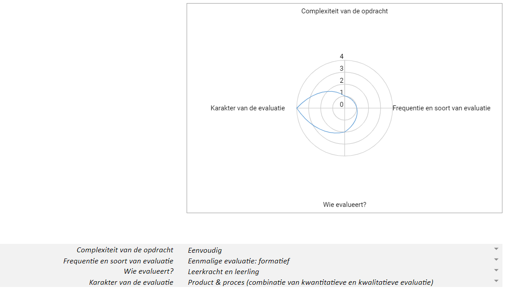

# Inspiratievoorbeelden

In wat volgt worden voorbeelden gegeven ter inspiratie.

Hier alvast een eerste voorbeeld: hoe evalueer je code die leerlingen geschreven hebben? Welke criteria zijn er zinvol?

----------------------

# Het evalueren van programmeren vereist een eigen aanpak

Programmeeropdrachten worden vaak verbeterd door leerkrachten die geen opleiding in informaticawetenschappen genoten. En omdat programmeren vaak aangewend wordt om met computationeel denken aan de slag te gaan in de klas, geven we hier enkele criteria mee om programmeeropdrachten te verbeteren.

Deze criteria zijn opgemaakt voor programmeeropdrachten in de eerste graad binnen een blokgebaseerde omgeving, maar zijn zeker ook zinvol in andere graden en binnen een tekstuele omgeving.

## Infographic Hoe evalueer ik grafische code?

-------------------------
## Evalueren van de volgende leeractiviteit: Verkennen van de constructiekit sociale robot

**Onderwijsdoel/leerplandoel:** 
De leerlingen onderscheiden bouwstenen van digitale systemen en lichten toe hoe deze samenwerken om een het systeem te laten functioneren.

**Concepten:** 
* Decompositie: componenten identificeren + verdeling elektronica/niet-elektronica
* Patroonherkenning: herkennen van invoer, verwerking, uitvoer en transport
* Abstractie: negeren van niet-elektronica componenten
* Digitaal inzicht: het functioneren van een digitaal systeem toelichten

**Leerdoelen:** 
* De leerlingen identificeren iedere component van de constructiekit en onderscheiden elektronica- en niet-elektronica van elkaar. (Begrijpen)
* De leerlingen focussen zich op de elektronica-componenten en negeren de niet-elektronica-componenten. (Toepassen)
* De leerlingen herkennen welke elektronica-componenten verantwoordelijk zijn voor invoer, verwerking, uitvoer en transport. (Begrijpen)
* De leerlingen verbinden zelf gekozen elektronische componenten met elkaar. (Toepassen)
* De leerlingen leggen uit hoe het digitaal systeem kan functioneren. (Begrijpen)

**Leerlingenopdrachten:** 
* De leerlingen verdelen de componenten van de constructiekit in volgens elektronica en niet-elektronica.
* De leerlingen gebruiken de leerlingenfiches om iedere elektronica-component van de constructiekit te benoemen.
* De leerlingen verdelen de elektronica-componenten in volgens invoer, verwerking, uitvoer en transport.
* De leerlingen gebruiken de leerlingenfiches om elektronische componenten aan te sluiten op de Dwenguino.
* De leerlingen lichten toe hoe hun digitaal systeem kan functioneren. Ze kiezen zelf hoe ze dit uitleggen via een tekening, tekst, filmpje ...

**Evaluatieaanpak:** 

