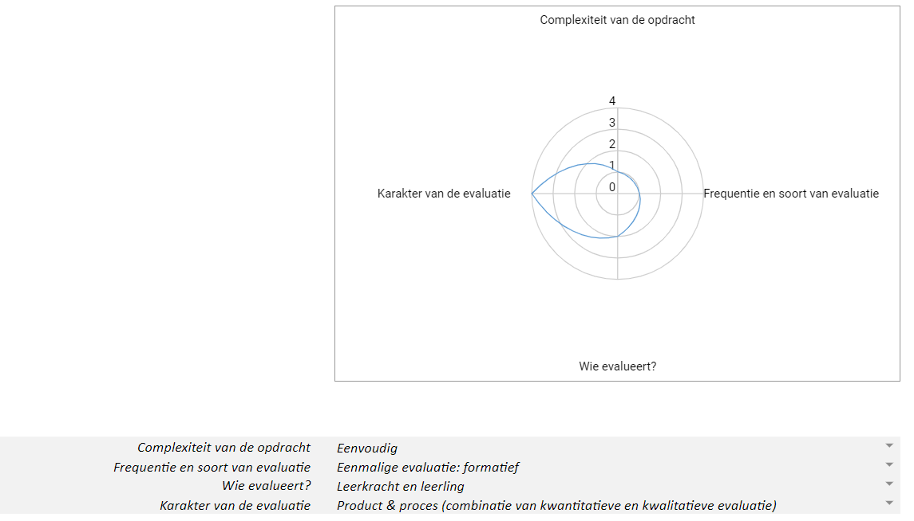

# Evalueren
## Evalueren van de volgende leeractiviteit: Verkennen van de constructiekit sociale robot

**Onderwijsdoel/leerplandoel:** 
De leerlingen onderscheiden bouwstenen van digitale systemen en lichten toe hoe deze samenwerken om het systeem te laten functioneren.

**Concepten:**
* Decompositie: componenten identificeren + verdeling elektronica/niet-elektronica
* Patroonherkenning: herkennen van invoer, verwerking, uitvoer en transport
* Abstractie: negeren van niet-elektronicacomponenten
* Digitaal inzicht: het functioneren van een digitaal systeem toelichten

**Leerdoelen:**
* De leerlingen identificeren iedere component van de constructiekit en onderscheiden elektronica en niet-elektronica van elkaar. (Begrijpen)
* De leerlingen focussen zich op de elektronicacomponenten en negeren de niet-elektronicacomponenten. (Toepassen)
* De leerlingen herkennen welke elektronicacomponenten verantwoordelijk zijn voor invoer, verwerking, uitvoer en transport. (Begrijpen)
* De leerlingen verbinden zelf gekozen elektronische componenten met elkaar. (Toepassen)
* De leerlingen leggen uit hoe het digitale systeem kan functioneren. (Begrijpen)

**Leerlingenopdrachten:**
* De leerlingen delen de componenten van de constructiekit in volgens elektronica en niet-elektronica.
* De leerlingen gebruiken de leerlingenfiches om iedere elektronicacomponent van de constructiekit te benoemen.
* De leerlingen verdelen de elektronicacomponenten in volgens invoer, verwerking, uitvoer en transport.
* De leerlingen gebruiken de leerlingenfiches om elektronische componenten aan te sluiten op de Dwenguino.
* De leerlingen lichten toe hoe hun digitaal systeem kan functioneren. Ze kiezen zelf hoe ze dit uitleggen via een tekening, tekst, filmpje ...

**Evaluatieaanpak:** 

