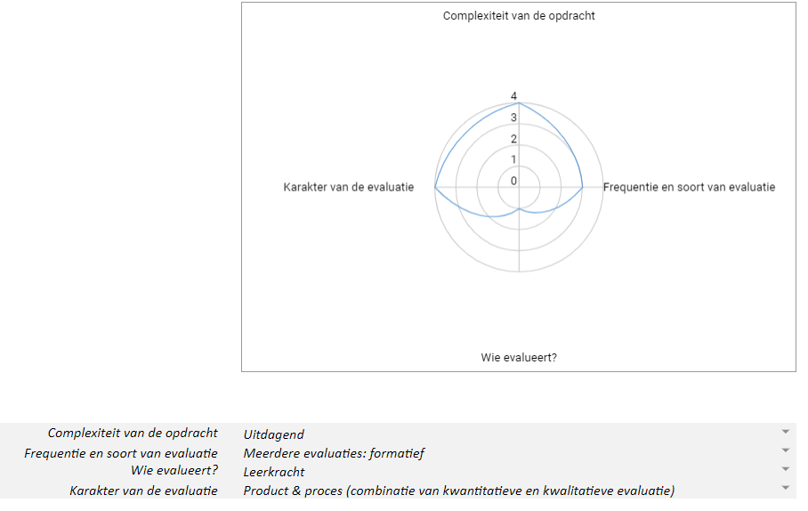

# Evaluatiekader

## Bias in AI-systemen a.d.h.v. inkleuren van Jommeke

**Onderwijsdoel:** 
De leerlingen analyseren de impact van digitale systemen op de maatschappij vanuit principes van computationeel denken.

**Voorbereiding leerkracht:** 
- Schema concepten CD invullen om de link met de basisconcepten van computationeel denken duidelijk te maken.

**Te evalueren leerdoel:** De leerlingen analyseren de output van het AI-systeem, gekoppeld aan de vooringenomenheid ervan, en zien het verband met de impact op de maatschappij van dit systeem.

**Opdrachten voor de leerlingen:**
-  Turingtest: identificeer of een afbeelding al dan niet artificieel is gegenereerd.
-  Bevindingen en argumenten bespreken tijdens een klassikaal onderwijsleergesprek.
-  Tekening maken die het AI-systeem kan omzeilen.
-  Korte uiteenzetting van de impact van het AI-systeem op de maatschappij.

**Evaluatieschema:**

  
**Opdrachten voor de leerlingen en voorgestelde evaluatievorm:**
-  Turingtest: identificeer of een afbeelding al dan niet artificieel is gegeneerd   &  Participatie: gedaan/niet gedaan (kwantitatief & formatief).
-  Bevindingen en argumenten bespreken tijdens een klassikaal onderwijsleergesprek & Klassikaal (1-2-3) exit ticket (kwalitatief & formatief).
-  Tekening maken die het AI-systeem kan omzeilen & Werkstuk: gelukt/niet gelukt (kwantitatief & formatief).
-  Korte uiteenzetting van de impact van het AI-systeem op de maatschappij & Werkstuk: document (kwalitatief & formatief).