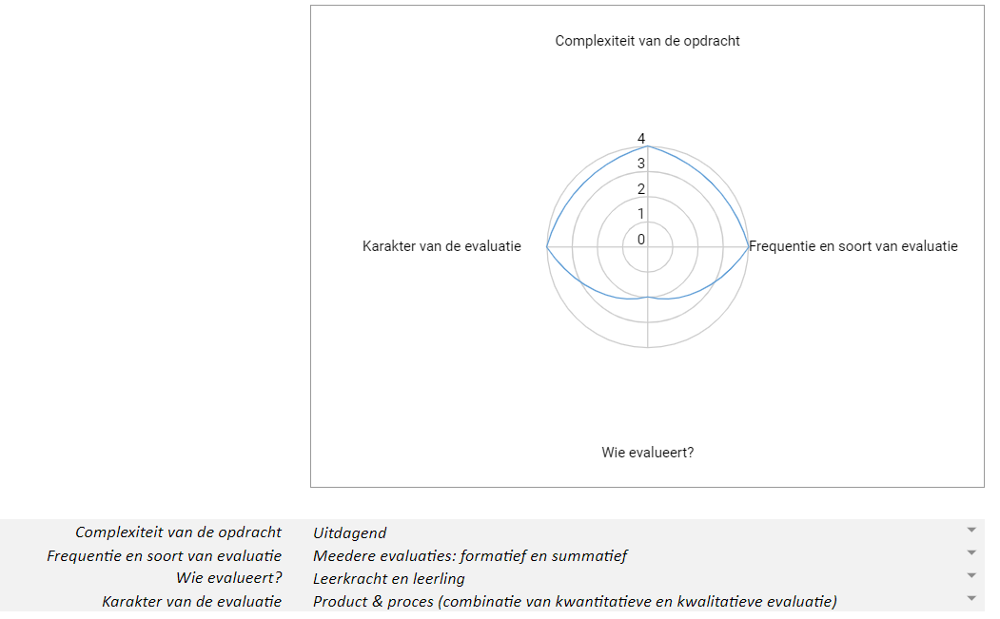

# Evaluatiekader

## Sentimentanalyse a.d.h.v. regelgebaseerd systeem 

### Onderwijsdoel: De leerlingen analyseren de impact van digitale systemen op de maatschappij vanuit principes van computationeel denken.

**Voorbereiding leerkracht:** 
- Schema concepten CD invullen om de link met de basisconcepten van computationeel denken duidelijk te maken.

**Te evalueren leerdoel:** Leerlingen analyseren de output van het AI-systeem, in het bijzonder de beperkingen en de mogelijkheden ervan, en zien het verband met de impact op de maatschappij van dit systeem. 

**Opdrachten voor de leerlingen:** 
- Computationeel denken over de werking van geautomatiseerde, regelgebaseerde sentimentanalyse a.d.h.v. onderwijsleergesprek: "Hoe breng ik dit naar de computer?"; 
- Leerlingen voeren sentimentanalyse unplugged uit op een review;
- Leerlingen beargumenteren kritisch wat dit betekent voor de maatschappelijke impact a.d.h.v. onderwijsleergesprek;
- Leerlingen analyseren de impact op de maatschappij van een regelbaseerd systeem voor cyberpestdetectie; 
- Leerlingen zoeken (originele) voorbeelden van taaltechnologie en delen die met de klas;
- Klassikaal onderwijsleergesprek betreffende patronen binnen de werking van verschillende taalsystemen.

**Evaluatieschema:**

**Opdrachten voor de leerlingen en voorgestelde evaluatievorm:** 
- Computationeel denken over de werking van geautomatiseerde, regelgebaseerde sentimentanalyse a.d.h.v. onderwijsleergesprek: "Hoe breng ik dit naar de computer?" & klassikaal exit ticket (formatief)
- Leerlingen voeren sentimentanalyse unplugged uit op een review & (individueel of in groep) schriftelijke neerslag (correct of niet - harde evaluatie) (summatief);
- Leerlingen beargumenteren kritisch wat dit betekent voor de maatschappelijke impact a.d.h.v. onderwijsleergesprek & klassikaal exit ticket (formatief);
- Leerlingen analyseren de impact op de maatschappij van een regelbaseerd systeem voor cyberpestdetectie individueel, schriftelijk reflectieverslag (summatief); 
- Leerlingen zoeken (originele) voorbeelden van taaltechnologie en delen die met de klas participatie (gedaan/ niet gedaan - harde evaluatie) (formatief) en peerfeedback (zachte evaluatie) (formatief);
- Klassikaal onderwijsleergesprek betreffende patronen binnen de werking van verschillende taalsystemen & klassikaal exit ticket (formatief).
