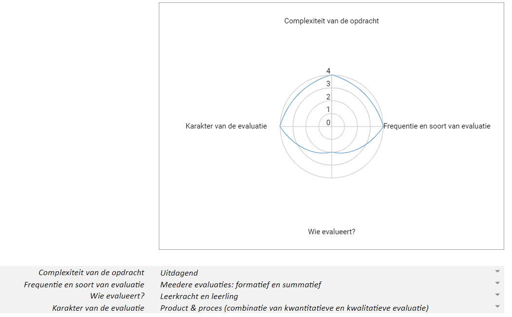

# Evaluatiekader

## Sentimentanalyse a.d.h.v. regelgebaseerd systeem 

**Onderwijsdoel:** 
De leerlingen analyseren de impact van digitale systemen op de maatschappij vanuit principes van computationeel denken.

**Voorbereiding leerkracht:** 
- Schema concepten CD invullen om de link met de basisconcepten van computationeel denken duidelijk te maken.

**Te evalueren leerdoel:** Leerlingen analyseren de output van het AI-systeem, in het bijzonder de beperkingen en de mogelijkheden ervan, en zien het verband met de impact op de maatschappij van dit systeem. 

**Opdrachten voor de leerlingen:**
- Computationeel denken over de werking van geautomatiseerde, regelgebaseerde sentimentanalyse a.d.h.v. onderwijsleergesprek: "Hoe breng ik dit naar de computer?".
- Leerlingen voeren sentimentanalyse unplugged uit op een review.
- Leerlingen beargumenteren kritisch wat dit betekent voor de maatschappelijke impact a.d.h.v. onderwijsleergesprek.
- Leerlingen analyseren de impact op de maatschappij van een regelgebaseerd systeem voor cyberpestdetectie.
- Leerlingen zoeken (originele) voorbeelden van taaltechnologie en delen die met de klas.
- Klassikaal onderwijsleergesprek betreffende patronen binnen de werking van verschillende taalsystemen.

**Evaluatieschema:**

**Opdrachten voor de leerlingen en voorgestelde evaluatievorm:**
- Computationeel denken over de werking van geautomatiseerde, regelgebaseerde sentimentanalyse a.d.h.v. onderwijsleergesprek: "Hoe breng ik dit naar de computer?" & klassikaal exit ticket (kwalitatieve evaluatie, formatief).
- Leerlingen voeren sentimentanalyse unplugged uit op een review & (individueel of in groep) schriftelijke neerslag (correct of niet - kwalitatieve evaluatie) (summatief).
- Leerlingen beargumenteren kritisch wat dit betekent voor de maatschappelijke impact a.d.h.v. onderwijsleergesprek & klassikaal exit ticket (kwantitatieve evaluatie, formatief).
- Leerlingen analyseren de impact op de maatschappij van een regelgebaseerd systeem voor cyberpestdetectie individueel, schriftelijk reflectieverslag (tussentijdse evaluatie kwalitatief, formatief - kwantitatief, summatief).
- Leerlingen zoeken (originele) voorbeelden van taaltechnologie en delen die met de klas participatie (gedaan/ niet gedaan - kwantitatieve evaluatie) (formatief) en peerfeedback (kwalitatieve evaluatie) (formatief).
- Klassikaal onderwijsleergesprek betreffende patronen binnen de werking van verschillende taalsystemen & klassikaal exit ticket (kwalitatieve evaluatie, formatief).
