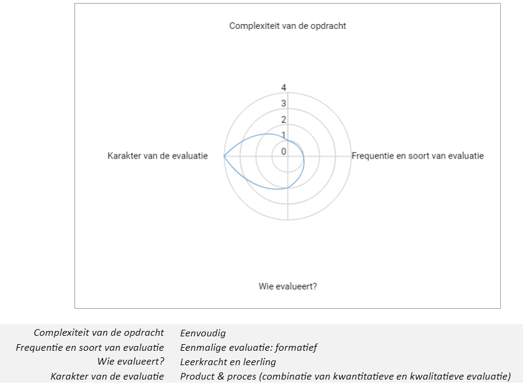

# Evaluatiekader

## Sociale robot: aan de slag met de Dwengo-simulator. Eenvoudige programmeeropdrachten in functie van het aanleren en inoefenen van principes en elementen van programmeren.  

**Onderwijsdoel:** 
De leerlingen ontwerpen een algoritme om een probleem digitaal op te lossen.

**Voorkennis:**
- De leerlingen herformuleren een probleem op een zodanige manier dat het mogelijk wordt om het probleem op te lossen door gebruik van een computer. 
- De leerlingen ontwerpen een algoritme door het expliciteren van een reeks van geordende instructies om het probleem op te lossen.

**Te evalueren leerdoel:** 
- De leerlingen zetten het algoritme om in grafische code.
- De leerlingen voeren de code uit (wat resulteert in een simulatie).
- De leerlingen debuggen de code.

**Opdrachten voor de leerlingen:**
- Programmeeroefeningen.
- Debuggen.
- Zelfreflectieformulier invullen.

**Evaluatieschema:**

**Opdrachten voor de leerlingen en voorgestelde evaluatievorm:**
- Programmeeroefeningen & Werkstuk: beoordeling code (kwantitatief & formatief).
- Debuggen & Rubric.
- Zelfreflectieformulier invullen & Zelfreflectie: na een iets grotere oefening (kwalitatief & formatief).
