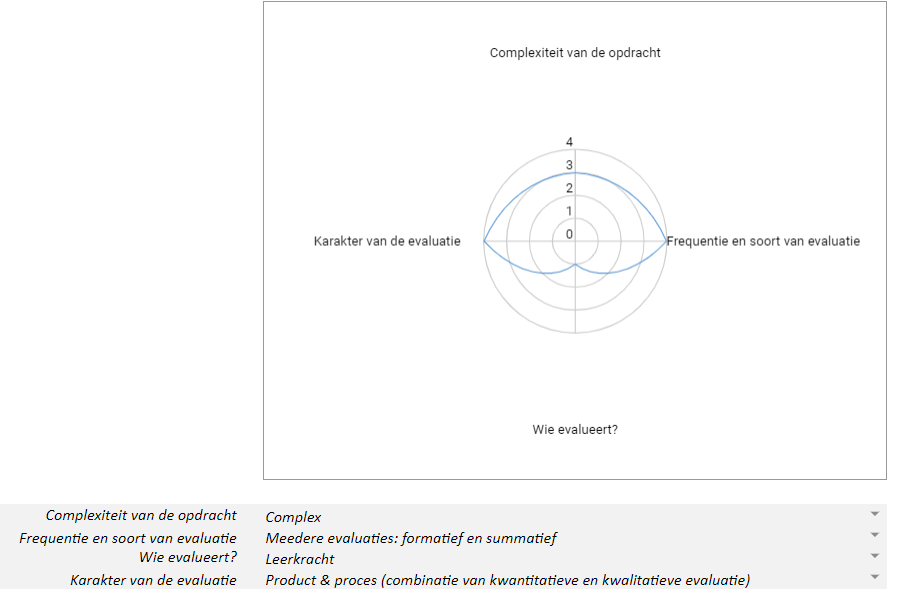

# Evaluatiekader

## AI in de Zorg - beslissingsbomen (H4 en verder)

**Onderwijsdoelen**
- De leerlingen gebruiken grafen voor een toepassing.
- De leerlingen analyseren de wisselwerking tussen wetenschappen, technologie, wiskunde en de maatschappij aan de hand van maatschappelijke uitdagingen.    
- De leerlingen analyseren de impact van digitale systemen op de maatschappij vanuit principes van computationeel denken.

**Voorbereiding leerkracht:** 
- 

**Te evalueren leerdoel:** 
- De leerlingen beschrijven opportuniteiten van het gebruik van beslissingsbomen in de zorg. 
- De leerlingen beschrijven dat er een getal nodig is om spreiding van variabelen te laten inschatten door een computer.
- De leerlingen genereren een beslissingsboom vanuit een tabel met Python.

**Opdrachten voor de leerlingen:**
- Klassikaal onderwijsleergesprek over beslissingsbomen a.d.h.v. 'echte' voorbeelden.
- Klassikaal onderwijsleergesprek: Computationeel denken: wat is nodig om een beslissingsboom door een computer te kunnen laten opstellen.
- Een voorbereiding maken tegen de volgende les: oefeningen op gini-index.
- Toets op gini-index.
- Beslissingsboom opstellen (unplugged) vanuit gegeven tabel.
- Dezelfde beslissingsboom opstellen (plugged) met Python notebook.
- Korte individuele uiteenzetting van de beperkingen en opportuniteiten van het gebruik van beslissingsbomen in de zorgsector.
 
**Evaluatieschema:**

**Opdrachten voor de leerlingen en voorgestelde evaluatievorm:**
- Klassikaal onderwijsleergesprek over beslissingsbomen a.d.h.v. 'echte' voorbeelden & Klassikaal (1-2-3) exit ticket (kwalitatief & formatief).
- Klassikaal onderwijsleergesprek: Computationeel denken: wat is nodig om een beslissingsboom door een computer te kunnen laten opstellen & Klassikaal (1-2-3) exit ticket (kwalitatief & formatief).
- Een voorbereiding maken tegen de volgende les: oefeningen op gini-index & Participatie: gedaan/niet gedaan (kwantitatief & formatief).
- Toets op gini-index & Klassieke toets (kwantitatief & summatief).
- Beslissingsboom opstellen (unplugged) vanuit gegeven tabel & Participatie: gedaan/niet gedaan (kwantitatief & formatief).
- Dezelfde beslissingsboom opstellen (plugged) met Python notebook & Werkstuk: gelukt/niet gelukt (kwantitatief & formatief) of nagaan van correcte aanpassing code, naamgeving variabelen (kwantitatief & summatief).
- Korte individuele uiteenzetting van de beperkingen en opportuniteiten van het gebruik van beslissingsbomen in de zorgsector & Werkstuk: document (kwalitatief & summatief).

