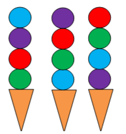
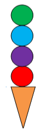

# Voorbeeld 3:  Patroon herkennen
Bron: [het online platform van de Belgische Bebras-wedstrijd](https://bebras.ugent.be/) 
Tekst: Opráné Vecsei Éva, HU, Zsuzsa Pluhár, HU, Sébastien Combéfis, BE 
Afbeeldingen: onbekend

## IJsjesmachine (Bebras 2013-HU-01)

Een ijsmachine produceert gekleurde bollen op een bijzondere systematische manier. Voor elk hoorntje worden er vier bollen geschept. Hieronder zie je hoe de laatste drie ijsjes eruit zagen die door de machine werden gemaakt:

*Hoe ziet het volgende ijsje eruit dat door de machine wordt gemaakt?*

##### Oplossing

##### Bespreking
In deze opgave wordt er expliciet gevraagd om een **patroon** te herkennen en te extrapoleren. Deze opgave is bedoeld voor heel jonge kinderen en is dus voor iedereen gemakkelijk te begrijpen.

De ijsmachine produceert bollen in vier verschillende kleuren en bovendien in een vaste volgorde die zich steeds herhaalt. Na vier bollen wordt een kleur dus herhaald. Dus de onderste bol van een ijsje heeft altijd dezelfde kleur als de bovenste bol van het vorige ijsje.

De kleuren van de bollen bij de laatste drie ijsjes waren de volgende: 
groen - rood - paars - blauw - blauw - groen - rood - paars - paars - blauw - groen - rood 
Dus de volgorde 'groen - rood - paars - blauw' wordt steeds herhaald en loopt door van het ene ijsje naar het andere. 

Het volgende ijsje moet dus eerst een rode bol krijgen en daarna 'paars - blauw - groen'.
