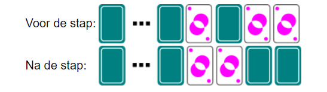
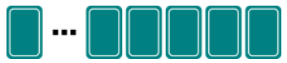

# Voorbeeld 4:  Algoritme toepassen en patroon herkennen
Bron: [het online platform van de Belgische Bebras-wedstrijd](https://bebras.ugent.be/) 
Tekst: Kris Coolsaet, BE 
Afbeeldingen: Kris Coolsaet, BE
 
## Kaarten omdraaien (Bebras 2018-BE-01a)
We spelen het volgende 'spelletje'. Voor je ligt een rij kaarten. Een kaart ligt ofwel met de prent naar boven of met de prent naar onder.

Één stap in het 'spel' gebeurt op de volgende manier: 
Je bekijkt de kaarten van rechts naar links. 
Als de huidige kaart met de prent naar beneden ligt, dan draai je de kaart met de prent naar boven en je stopt. 
Als de huidige kaart met de prent naar boven ligt, dan draai je ze met de prent naar onder en je gaat verder met de kaart links ervan. 
Ben je alle kaarten gepasseerd, dan stop je.

De afbeelding hieronder toont het effect van opeenvolgende stappen: je draait eerst de kaart helemaal rechts om, dan de kaart links ervan en dan de kaart links daarvan. En dan moet je stoppen, want de derde kaart ligt nu met de prent naar boven.

Het spel start met 32 kaarten met alle prenten naar beneden:

*Hoeveel kaarten liggen met de prent **naar boven** nadat je precies 32 stappen in het spel hebt gedaan? (Antwoord met een getal.)*

##### Oplossing

Merk op dat na 1 stap, na 2, 4, 8 stappen er telkens 1 kaart met de prent naar boven ligt. Dat zijn stappen 20, 21, 22, 23, alle machten van 2. 32 is ook een macht van 2. Na 32 stappen ligt er 1 kaart met de prent naar boven. 

##### Bespreking

Merk op dat je hier opnieuw een algoritme uitvoert en niet zelf bedenkt, zoals in voorbeeld 2.
Behalve het feit dat je hier een **algoritme** moet uitvoeren, is hier ook sprake van **patroonherkenning**. Tijdens het uitvoeren van het algoritme moet je merken dat er precies één kaart met de prent naar boven ligt na 1 stap, na 2 stappen, na 4 stappen, en dan telkens na het dubbel aantal stappen als de keer ervoor. Het aantal stappen is dus steeds een macht van 2. 32 is 2 tot de vijfde, dus ook dan ligt er één kaart met de prent naar boven. 

Binnenin een computer worden getallen voorgesteld in zogenaamde binaire notatie: een getal wordt 'geschreven' met enkel enen en nullen (bits genoemd). 
Bv. 1 wordt voorgesteld als 0...00001, 2 als 0...00010, 3 als 0...00011, 4 als 0...00100, 5 als 0...00101, 6 als 0...00110, enz. (Moderne computers gebruiken vaak 32 bits om een getal voor te stellen.) 
Herken je deze patronen? Wanneer je voor bit 0 een kaart met de prent naar beneden legt, en voor bit 1 met de prent naar boven, dan krijg je dezelfde patronen als bij de eerste 6 stappen van ons spel. Als je weet dat de binaire voorstelling van 32 niets anders dan 0...01000000 is, dan zie je dat er na 32 stappen precies één kaart met de prent naar boven ligt. 
Wat we in deze puzzel een 'stap' noemen, is wat er door de elektronica van een computer gebruikt wordt om een binair getal met 1 te verhogen.
