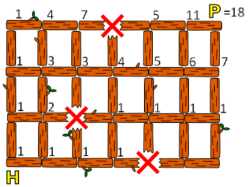

# Voorbeeld 5:  Algoritme bedenken
Bron: [het online platform van de Belgische Bebras-wedstrijd](https://bebras.ugent.be/) 
Tekst: Yukio Idosaka, JP, Yasushi Kuno, JP, Elena Sutkute, LT, Juha Vartiainen, FI, Barbara Müllner, AT 
Afbeeldingen: Maiko Shimabuku, JP, Javier Bilbao, ES

## Kortste route (Bebras 2013-JP-10)

De kleine bever speelt graag in het park. Zijn huis (H) en het park (P) zijn met elkaar verbonden door bruggen, gemaakt van boomstammen van dezelfde lengte, zoals je ziet op de kaart hieronder:

Er zijn echter enkele plaatsen op de kaart, aangeduid met een rode X, waar hij niet voorbij kan.

*Hoeveel verschillende routes van het huis naar het park kan hij volgen met dezelfde minimale lengte?*

##### Oplossing

ER zijn 18 routes met dezelfde minimale lengte (nl. 9 verplaatsingen, 6 naar rechts en 3 naar boven).

Het aantal mogelijke routes tot aan een bepaald kruispunt is de som van het aantal routes dat van links komt en het aantal dat van beneden komt. (Je mag niet van rechts of van boven komen, want dan moet je ooit terugkeren en dan is het pad niet van minimale lengte.) 
Daarom noteer je vanaf links onderaan bij elk kruispunt de aantallen en verplaats je je stap voor stap naar rechts en naar boven. Het getal dat je dan rechtsboven opschrijft, is het uiteindelijke antwoord.

##### Bespreking

De oplossing bestaat uit twee denkstappen: 
- een eerste stap bestaat erin zich te realiseren dat je in een kortste route noodgedwongen nooit naar links of naar beneden beweegt;
- in een tweede stap hoef je dus enkel dergelijke routes te bekijken.

In tegenstelling tot voorbeelden 2 en 4, moet je hier wel zelf een **algoritme** opstellen om tot de oplossing te komen: je moet een systematische manier bedenken om tot die oplossing te komen.  
De *brute benadering*, nl. alle mogelijkheden uitproberen en hopen dat je er geen vergeten bent, werkt niet; er is echt nood aan het bedenken van een systematische manier om dit probleem op te lossen (m.a.w. een algoritme). 
Bij dit voorbeeld: van linksonder naar rechtsboven werken en telkens bij de boomstammen opschrijven hoeveel wegen ernaartoe leiden.

Merk op dat je hier wel algoritmisch denken nodig hebt, maar niet hoeft te programmeren!

De techniek die je gebruikt om deze opgave op te lossen, heet *dynamisch programmeren*: je verdeelt je probleem in kleinere deelproblemen die je gemakkelijk kan oplossen. In dit geval is het deelprobleem 'hoeveel routes zijn er naar het kruispunt waar we net mee bezig zijn?' Dat aantal routes hangt af van het aantal routes naar het kruispunt waar je net van komt. Je begint daarom links onderaan en je gaat stap voor stap naar rechts en naar boven, en je schrijft bij elk kruispunt de aantallen op tot je rechtsboven aankomt. 
*Misschien had je al ervaring met dit soort problemen en herkende je dat dynamisch te programmeren hier misschien snel tot de oplossing zou kunnen leiden.*
