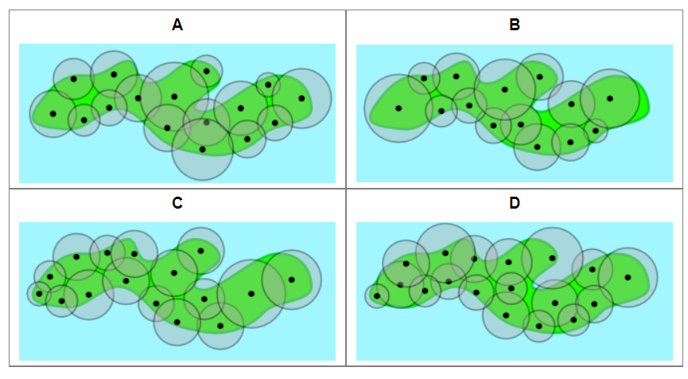
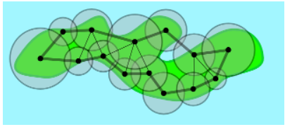

# Voorbeeld 6:  Abstractie maken
Bron: [het online platform van de Belgische Bebras-wedstrijd](https://bebras.ugent.be/) 
Tekst: Zoltán Molnár, HU, Zsuzsa Pluhár, HU 
Afbeeldingen: Ivo Blöchliger, CH 
Vertaling: Kris Coolsaet 

## Stormbestendig netwerk (Bebras 2014-HU-02) 

De GSM-maatschappij Bever Telecom wil GSM-masten plaatsen op Windeneiland. 
Het dekkingsgebied van een mast is een cirkel die errond is gecentreerd. Twee masten heten *verbonden* met elkaar als hun dekkingsgebieden overlappen. Twee masten kunnen met elkaar *communiceren* als er een rij tussenliggende masten bestaat zodat elke mast met elke volgende is verbonden. 
Door de sterke wind op het eiland gebeurt het af en toe dat een mast breekt. Als er ergens één mast niet meer functioneert, willen we toch nog dat elke twee van de overblijvende torens met elkaar kunnen blijven communiceren.

*Welke van de opstellingen hieronder moeten we hiervoor gebruiken?*

##### Oplossing

Het juiste antwoord is B. 

##### Bespreking

In de afgebeelde opstellingen worden masten voorgesteld door punten en dekkingsgebieden door cirkels. Dit is een eerste **abstractie** die je correct moet interpreteren.

Om tot een oplossing te komen, voer je een **bijkomende abstractie** in door de overlappende cirkels te vervangen door een boog in een graaf: je verbindt twee masten met elkaar wanneer de overeenkomstige cirkels overlappen, en je verwijdert de cirkels. Dit is een cruciaal deel van het oplossingsproces.

Abstractie kan dus op twee verschillende manieren voorkomen in computationeel denken:
- een gegeven abstractie correct kunnen interpreteren;
- zelf tot een abstractie komen om een probleem gemakkelijker op te lossen.
