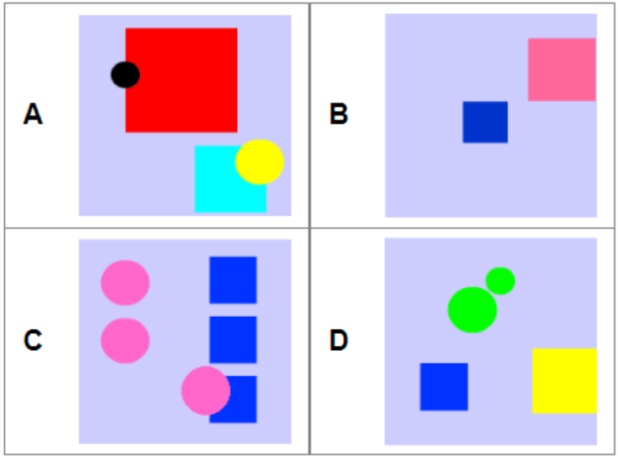
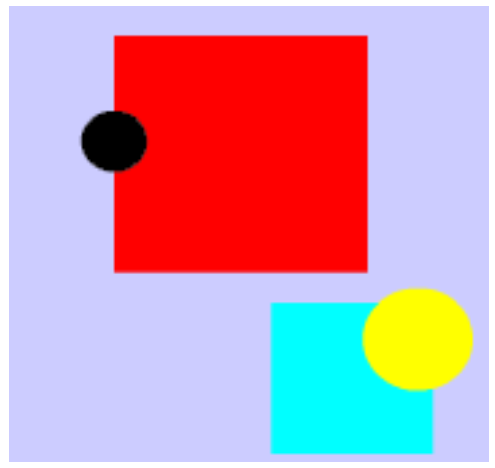

# Voorbeeld 7:  Abstractie en algoritme
Bron: [het online platform van de Belgische Bebras-wedstrijd](https://bebras.ugent.be/) 
Tekst: Kris Coolsaet, BE 
Afbeeldingen: Kris Coolsaet, BE 

## Toevalsprenten (Bebras ...)

De bevers hebben een klein bedrijfje dat gepersonaliseerde wenskaarten en geschenkpapier ontwerpt. De verschillende modellen worden gemaakt aan de hand van de volgende instructies:

1. Maak een cirkel C aan van een willekeurige kleur.
2. Herhaal de volgende stappen een willekeurig aantal keer. 
&nbsp;&nbsp;&nbsp;&nbsp;1. Maak een vierkant V aan van een willekeurige kleur en grootte. 
&nbsp;&nbsp;&nbsp;&nbsp;2. Kies een willekeurige grootte voor C: ofwel *klein*, ofwel *groot*. 
&nbsp;&nbsp;&nbsp;&nbsp;3. Druk C af, ergens op een willekeurige plaats. 
&nbsp;&nbsp;&nbsp;&nbsp;4. Druk V af, ergens op een willekeurige plaats. 

(Ter informatie: een vorm aanmaken betekent dat de vorm in het computergeheugen wordt aangemaakt, maar niet dat hij ook op papier wordt afgedrukt of getekend.)

*Welke van de volgende modellen werd niet door dit bedrijfje ontworpen?*

##### Oplossing

Het volgende model kan niet door dit bedrijfje zijn gemaakt:

##### Bespreking

Deze afbeelding bevat twee cirkels van verschillende grootte en van een verschillende kleur. In het algoritme wordt de kleur van de cirkel slechts één keer bepaald, namelijk helemaal in het begin; nadien kunnen de cirkels nog wel van grootte veranderen, maar niet van kleur. 
Alle andere antwoorden zijn mogelijke ontwerpen, ook al is dat misschien niet meteen duidelijk. Er moeten evenveel cirkels als vierkanten worden afgedrukt, maar het is best mogelijk dat een vierkant bovenop een cirkel wordt gedrukt en deze op die manier verbergt! Hou er ook rekening mee dat een cirkel of een vierkant toevallig dezelfde kleur kan hebben als de achtergrond.

Je moet het **algoritme** in voldoende mate kunnen toepassen. Als je inziet dat alle cirkels dezelfde kleur moeten hebben, dan heb je **abstractie** gemaakt van de instructies in het **algoritme**. Weten dat alle cirkels dezelfde kleur moeten hebben, is het enige dat van belang is om het antwoord te kunnen geven op de gestelde vraag. Je gebruikt eigenlijk slechts een deel van het algoritme. 
