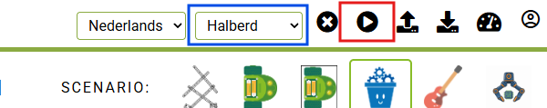
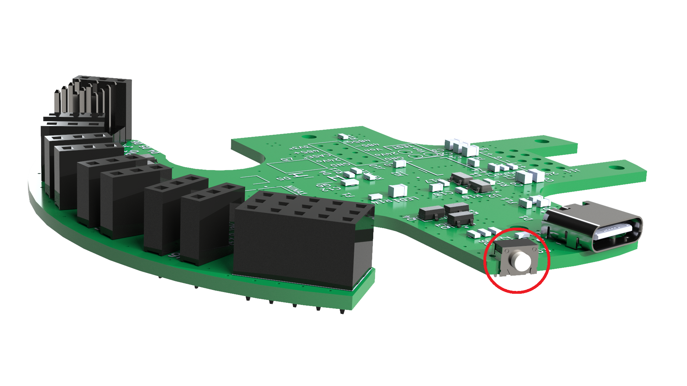
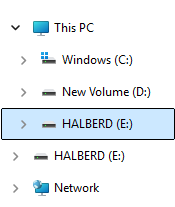

    <h1 class="title">Code uploaden</h1>
    <h2 class="subtitle">Hoe zet ik een programma vanuit DwenguinoBlockly op de Halberd?</h2>
    

        

            <h3 class="info_item_title">1. De binaire code downloaden</h3>
            

                Selecteer in het menu eerst het Halberd-bord. Klik vervolgens op de knop om je programma te compileren en te downloaden. Op de afbeelding hieronder is de bordkeuze aangeduid met een blauwe rechthoek en de compileer- en downloadknop met een rode rechthoek.
            

            

                </img>
            

            

                Na het klikken verschijnt er een tandwiel op de plaats van de knop. Je programma wordt dan op de server gecompileerd. Dit kan even duren, dus wacht tot het UF2-bestand automatisch wordt gedownload naar de map 'Downloads'. Dit bestand bevat de binaire code: de vertaling van je programma naar een taal die de Halberd begrijpt.
            

        

        

            <h3 class="info_item_title">2. USB-kabel aansluiten</h3>
            

                Verbind de computer met de Halberd via de USB-kabel.
            

        

        

            <h3 class="info_item_title">3. De Halberd in programmeermodus zetten</h3>
            

                Druk twee keer snel na elkaar op de knop op de Halberd die op de afbeelding hieronder is aangeduid. De Halberd start nu zijn UF2 USB-bootloader en verschijnt als een USB-apparaat in de Verkenner van Windows.
            

            

                </img>
            

            

                Druk je slechts een keer op deze knop, dan reset de Halberd en start het programma dat erop staat opnieuw vanaf het begin.
            

        

        

            <h3 class="info_item_title">4. Bestand overzetten</h3>
            

                Open de USB-schijf met de naam 'HALBERD' in de Verkenner van Windows. Sleep het gedownloade UF2-bestand uit de map 'Downloads' naar deze USB-schijf.
            

            

                </img>
            

            

                Soms verschijnt er daarna een foutmelding van Windows omdat de verbinding met de Halberd onverwacht wegvalt. Dat is normaal: de Halberd start opnieuw op om je programma uit te voeren. Je mag deze foutmelding gewoon wegklikken.
            

        

        

            <h3 class="info_item_title">5. Het programma uitvoeren</h3>
            

                Zodra het UF2-bestand is overgezet, start de Halberd automatisch opnieuw op en voert hij je programma uit.
            

        

    

