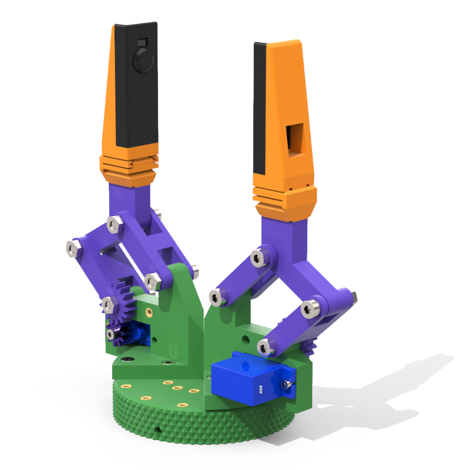

    <h1 class="title">De mechanica van de parallellogram-grijper</h1>
    <h2 class="subtitle">Hoe werkt de parallellogram-grijper?</h2>
    

        

            <h3 class="info_item_title">De parallellogram-grijper</h3>
            

                De parallellogram-grijper gebruikt een eenvoudig parallellogrammechanisme om de draaiende beweging van de motor om te zetten in een beweging van de vingers. Wanneer de motor draait, beweegt de koppeling de vingers naar elkaar toe of van elkaar weg. Door de vorm van het parallellogram blijven de vingers tijdens die beweging ongeveer evenwijdig, zodat de grijper een voorwerp recht en stevig kan vastnemen.
            

            </img>
        

        

            <h3 class="info_item_title">Onderdelen</h3>
            <ul class="info_item_content">
                <li>De Halberd-connectieplaat</li>
                <li>De vingerbasis</li>
                <li>De MG90-servo</li>
                <li>4 M3 x 6-inbusbouten</li>
                <li>2 M2 x 6-inbusbouten</li>
                <li>1 M2,5 x 6-inbusbout</li>
                <li>Tandwiel (d10, Z1, m10)</li>
            </ul>
            

                Gebruik de M3-bouten om de vingerbasis aan de connectieplaat te bevestigen. Met de M2-bouten bevestig je de servo. De M2,5-bout gebruik je om het tandwiel aan de servo te bevestigen.
            

            

                De eerste keer dat je het tandwiel op de servo schroeft, kan dat vrij stroef gaan. Een 3D-printer kan de fijne vorm van de servohoorn niet volledig afdrukken. Daarom wordt de vorm van de servohoorn bij de eerste montage vast in het tandwiel gedrukt.
            

            <video controls title="Montage van de basis van de vinger">
                <source src="img/finger_base_assembly.mp4" type="video/mp4">
                Je browser ondersteunt deze video niet.
            </video>
        

        

            <h3 class="info_item_title">Werking</h3>
            

                [Beschrijving van de mechanische werking]
            

        

    

