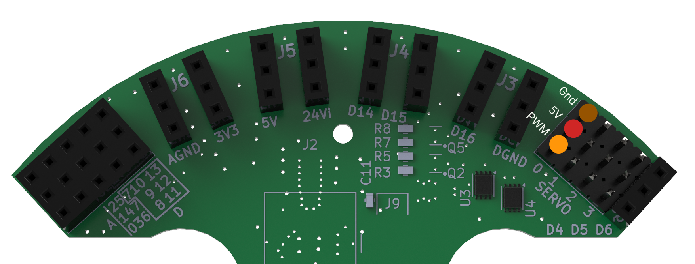

    <h1 class="title">Elektronica en programmeren van de parallellogram-grijper</h1>
    <h2 class="subtitle">Hoe sluit je de grijper aan en bestuur je hem?</h2>
    

        

            <h3 class="info_item_title">De servo aansluiten</h3>
            

                De Halberd heeft vier aansluitingen voor servo's. Elke servo-aansluiting heeft drie pinnen: GND, 5V en PWM. Sluit de stekker van de servo aan door de draden te laten overeenkomen met de gekleurde stippen bij de pinlabels op de Halberd.
            

            

                GND is de massapin, 5V voedt de servo en de PWM-pin stuurt de positie van de servo aan. Controleer voor je de Halberd inschakelt of elke draad bij het juiste label aangesloten is.
            

            </img>
            

                Voor de parallellogram-grijper sluit je de servo aan op een van deze vier servo-aansluitingen. Onthoud welke aansluiting je gebruikt, zodat je in je programma dezelfde PWM-aansluiting kunt selecteren.
            

        

        

            <h3 class="info_item_title">De grijper programmeren</h3>
            

                                Met dit programma beweegt de servo die op SERVO_2 is aangesloten langzaam van 0 naar 90 graden en daarna terug naar 0 graden. De beweging wordt voortdurend herhaald. Zo opent en sluit de parallellogram-grijper. De vertraging van 10 milliseconden tussen twee hoeken zorgt voor een vloeiende beweging.
            

                        

                                <pre>
<code class="language-cpp" data-filename="parallellogram_grijper.cpp">
#include &lt;Wire.h&gt;
#include &lt;Dwenguino.h&gt;
#include &lt;LiquidCrystal.h&gt;
#include &lt;Servo.h&gt;

// Maak een servo-object voor de servo-aansluiting SERVO_2.
Servo servoOnPinSERVO_2;

void setup()
{
// Bereid de functies van de Dwenguino voor.
initDwenguino();
// Koppel het servo-object aan de aansluiting SERVO_2.
servoOnPinSERVO_2.attach(SERVO_2);
}

void loop()
{
// Beweeg de servo van 0 naar 90 graden.
for (int hoek = 0; hoek &lt; 90; hoek++) {
servoOnPinSERVO_2.write(hoek);  // Stuur de servo naar deze hoek.
delay(10);                       // Wacht even voor een vloeiende beweging.
}

// Beweeg de servo daarna terug van 90 naar 0 graden.
for (int hoek = 90; hoek &gt; 0; hoek--) {
servoOnPinSERVO_2.write(hoek);  // Stuur de servo naar deze hoek.
delay(10);                       // Wacht even voor een vloeiende beweging.
}
}
</code>
                                </pre>
                        

        

    

