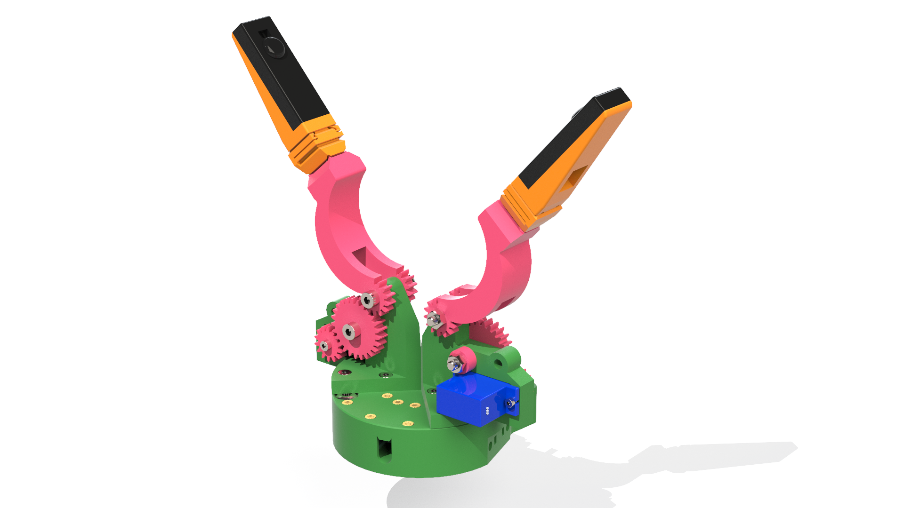
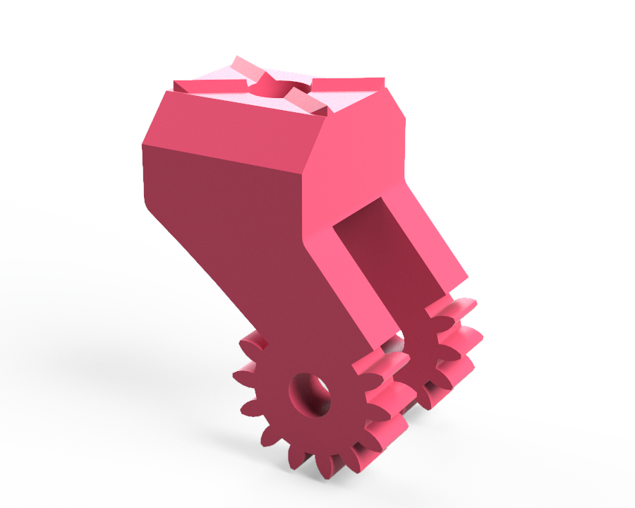
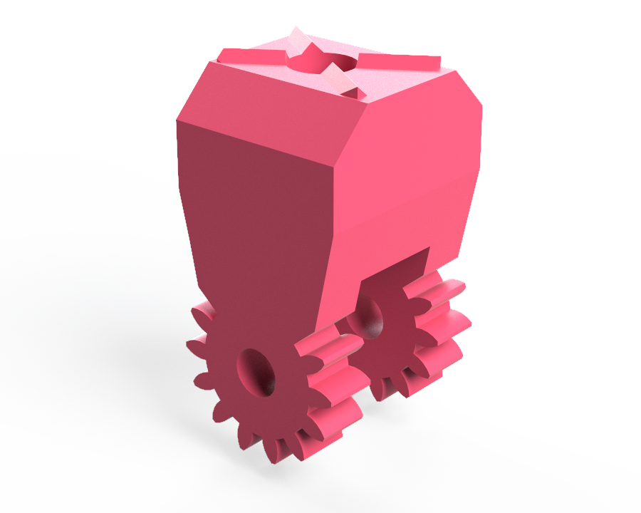

	<h1 class="title">De rotatiegrijper</h1>
	<h2 class="subtitle">Hoe werkt de rotatiegrijper?</h2>
	

		

			<h3 class="info_item_title">De rotatiegrijper</h3>
			

				De rotatiegrijper gebruikt een draaibare arm om een voorwerp vast te nemen. De motor laat de arm draaien: de arm beweegt naar het voorwerp toe om het vast te grijpen en draait terug om het weer los te laten.
			

			</img>
		

		

			<h3 class="info_item_title">Onderdelen</h3>
			

				De onderdelen die je voor elke montagestap nodig hebt, worden in de bijhorende video getoond.
			

		

		

			<h3 class="info_item_title">Stap 1: Monteer de basis</h3>
			

				Monteer de basis van de rotatiegrijper zoals getoond in de video.
			

			

				<iframe width="560" height="315" src="https://www.youtube.com/embed/8SXgMIjR1F8" title="Montage van de basis van de rotatiegrijper" frameborder="0" allow="accelerometer; autoplay; clipboard-write; encrypted-media; gyroscope; picture-in-picture; web-share" referrerpolicy="strict-origin-when-cross-origin" allowfullscreen></iframe>
			

		

		

			<h3 class="info_item_title">Stap 2: Monteer de grijpvinger</h3>
			

				Bevestig de grijpvinger aan de rotatiegrijper zoals getoond in de video.
			

			

				<iframe width="560" height="315" src="https://www.youtube.com/embed/_0uqOt-DPBY" title="Montage van de grijpvinger van de rotatiegrijper" frameborder="0" allow="accelerometer; autoplay; clipboard-write; encrypted-media; gyroscope; picture-in-picture; web-share" referrerpolicy="strict-origin-when-cross-origin" allowfullscreen></iframe>
			

		

		

			<h3 class="info_item_title">Alternatieve grijpvingers</h3>
			

				Deze alternatieve grijpvingers hebben een andere geometrie en zijn korter. Je kunt ze als basis gebruiken om je eigen grijpvingers te ontwerpen en verder te bouwen.
			

			</img>
			</img>
		

		

			<h3 class="info_item_title">Werking</h3>
			

				Wanneer de motor in de ene richting draait, beweegt de rotatiearm naar de gesloten stand en kan de grijper een voorwerp vastnemen. Draait de motor in de andere richting, dan beweegt de arm terug naar de open stand en laat de grijper het voorwerp los.
			

		

	

