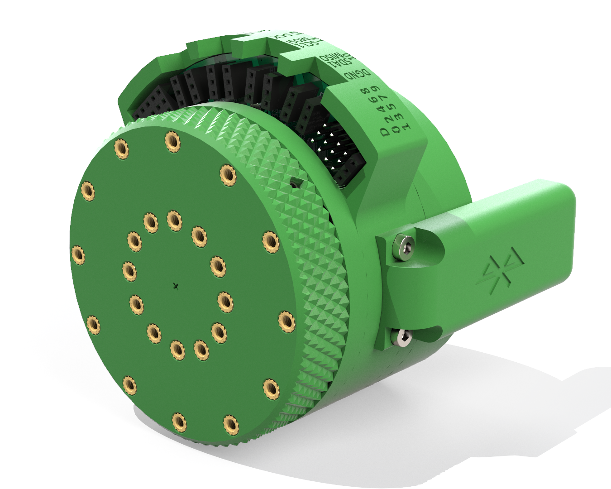
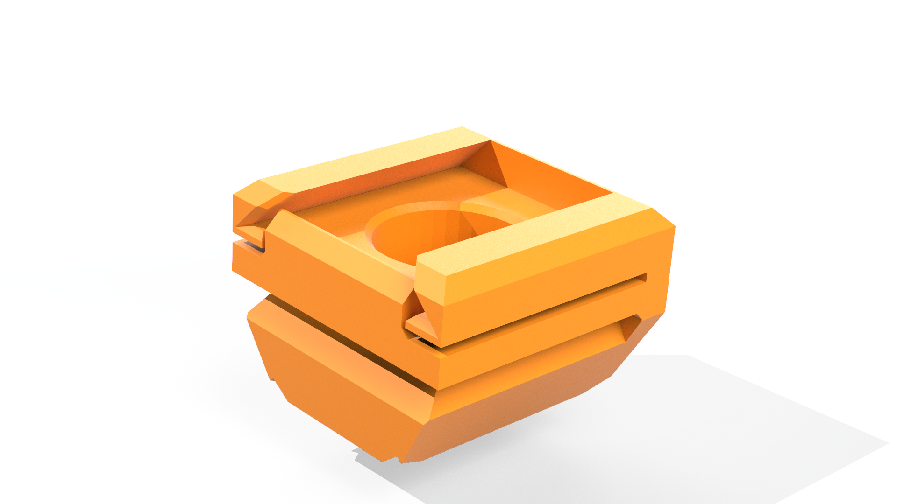
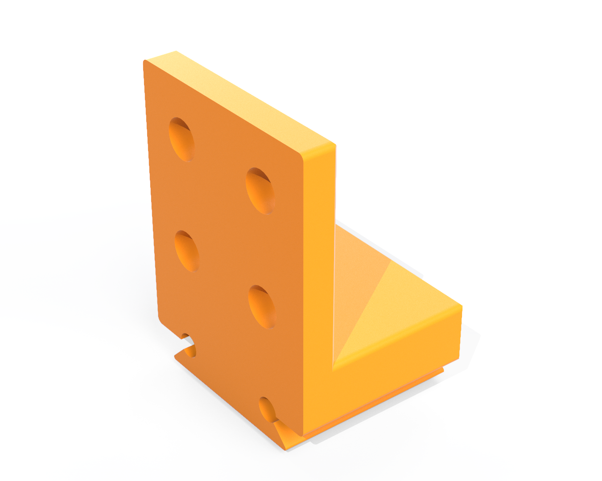
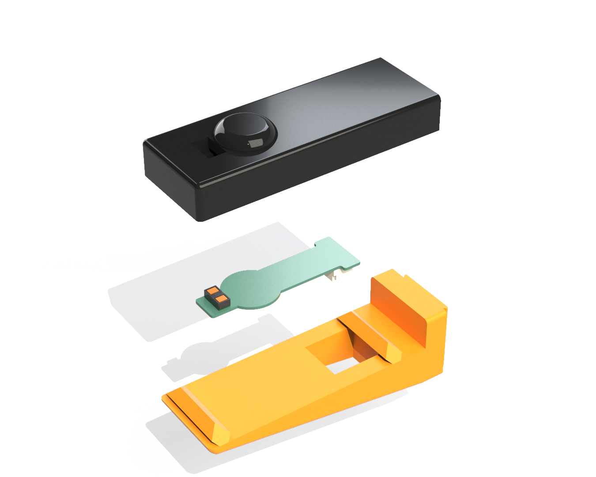

    <h1 class="title">Bouw je eigen grijper</h1>
    <h2 class="subtitle">Ontwerp een grijper die past bij jouw opdracht</h2>
    

        

            <h3 class="info_item_title">Kies jouw vertrekpunt</h3>
            

                Met het Halberd-platform kun je een robotgrijper volledig zelf ontwerpen. Je kunt ook vertrekken van een bestaand mechanisme en daar eigen vingers of vingertoppen aan toevoegen. Kies de aanpak die het best past bij jouw ontwerp.
            

        

        

            <h3 class="info_item_title">1. Bouw vanaf nul</h3>
            

                Wil je een volledig eigen grijper bouwen? Bevestig je ontwerp dan op de robotpols met de Halberd-microcontroller. De pols heeft een connectieplaat met 12 x 2 radiaal geplaatste M3-inzetmoeren. Daarop kun je jouw grijper of eigen onderdelen vastschroeven.
            

            </img>
        

        

            <h3 class="info_item_title">2. Bouw je eigen vinger(s)</h3>
            

                Je hoeft niet vanaf nul te beginnen. Je kunt vertrekken van een bestaand aandrijfmechanisme, zoals de parallellogram-grijper of de rotatiegrijper. In de toekomst komen er nog andere mechanismen bij. Ontwerp vervolgens je eigen robotvingers en bevestig ze met de zwaluwstaartverbinding aan de grijper.
            

            </img>
            

                Je kiest zelf hoeveel vingers je grijper krijgt. De Halberd-connectieplaat ondersteunt twee tot vier vingers. De vingerverlenging met bouwplaat is een goed vertrekpunt voor een eigen vinger die je eenvoudig op de zwaluwstaartverbinding kunt vastmaken.
            

            </img>
        

        

            <h3 class="info_item_title">3. Bouw je eigen vingertoppen</h3>
            

                Wil je de bestaande vingers behouden? Experimenteer dan met eigen vingertoppen die je op een bestaande vinger bevestigt. Probeer bijvoorbeeld materialen met meer of minder wrijving, of ontwerp een vingertop met complexe sensoren erin.
            

            </img>
        

    

