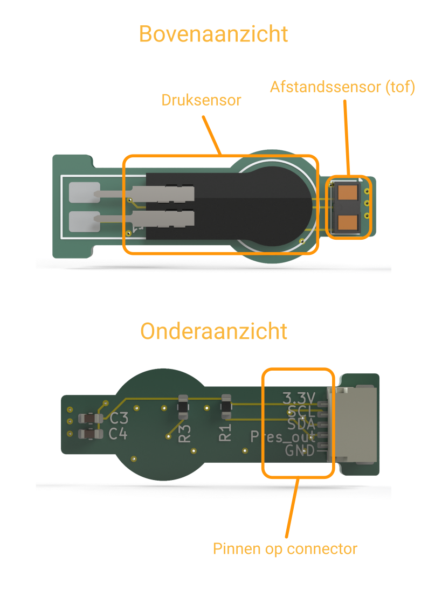

    <h1 class="title">Vingertopsensormodule</h1>
        <h2 class="subtitle">Meet kracht en afstand met je robotvinger</h2>
        

                

                        <h3 class="info_item_title">De sensormodule</h3>
                        

                                De vingertopsensormodule bevat een druksensor en een VL53L4CD time-of-flight-afstandssensor. De druksensor meet de kracht op het sensoroppervlak. De afstandssensor meet de afstand tot een voorwerp. Zo kan je grijper voelen wanneer hij een voorwerp vastneemt en hoe ver dat voorwerp nog verwijderd is.
                        

                        </img>
                        </img>
                

                

                        <h3 class="info_item_title">Sluit de sensormodule aan</h3>
                        

                                Verbind de sensormodule met de Halberd volgens onderstaande tabel. De afstandssensor gebruikt de I2C-verbinding via SDA en SCL. De druksensor geeft zijn meetwaarde door via een analoge ingang.
                        

                        

                                <table>
                                        <tr>
                                                <th>Pin op de sensormodule</th>
                                                <th>Pin op de Halberd</th>
                                                <th>Functie</th>
                                        </tr>
                                        <tr><td>3.3V</td><td>3.3V</td><td>Voeding</td></tr>
                                        <tr><td>GND</td><td>GND</td><td>Massa</td></tr>
                                        <tr><td>SDA</td><td>D16</td><td>I2C-data voor de afstandssensor</td></tr>
                                        <tr><td>SCL</td><td>D15</td><td>I2C-klok voor de afstandssensor</td></tr>
                                        <tr><td>Pres_out</td><td>A0</td><td>Analoge meetwaarde van de druksensor</td></tr>
                                </table>
                        

                

        

        

                        <h3 class="info_item_title">Meetwaarden uitlezen</h3>
                        

                                Het programma leest de spanning van de druksensor en de afstand van de VL53L4CD-sensor in millimeter. Daarna stuurt het beide waarden elke lus via de seriële verbinding naar de computer. De waarden staan op elke regel, gescheiden door een puntkomma: eerst de drukmeting, daarna de afstand.
                        

                        

                                <pre>
<code class="language-cpp" data-filename="vingertop_sensor_module.cpp">
/**
 * Met dit voorbeeld kan je de sensoren op de Halberd vingertop sensormodule lezen:
 *  - kracht op het sensoroppervlak (een analoge waarde tussen 0 en 1024), en
 *  - de meting van de VL53L4CD time-of-flight afstandssensor.
 *
 * Bedrading:
 *  - Sensormodule SDA -> Halberd SDA (pin D16).
 *  - Sensormodule SCL -> Halberd SCL (pin D15).
 *  - Uitvoer krachtsensor (Pres_out) -> Halberd A0.
 *
 * De gegevens worden via seriële communicatie naar de computer verstuurd (baud rate = 9600)
 */
#include <HalberdGripperSensor.h>
#include <Arduino.h>

HalberdGripperSensor sensorsWire(PIN_A0, Wire);
HalberdGripperSensor* sensors = nullptr;
const char* activeBusName = "none";
const bool kEnableSensorDebug = false;

void setup() {
    // Stel LED pinnen in als uitvoer.
    pinMode(LED_GREEN, OUTPUT);
    pinMode(LED_RED, OUTPUT);
    pinMode(LED_BLUE, OUTPUT);
  
    // Start de seriële communicatie.
    Serial.begin(9600);

    // Zet leds uit.
    digitalWrite(LED_GREEN, LOW);
    digitalWrite(LED_RED, LOW);
    digitalWrite(LED_BLUE, LOW);

    while (!Serial) {
        delay(10);
        // Knipper de rode led zolang er geen verbinding is.
        digitalWrite(LED_RED, millis() % 500 &lt; 250 ? HIGH : LOW);
    }

    sensorsWire.setDebugOutput(kEnableSensorDebug);
    // Optional tuning APIs:
     sensorsWire.setRangeTimingMs(10, 0);   // faster updates, less averaging
    // sensorsWire.setDistanceOffsetMm(-3);    // close-range calibration offset

    if (sensorsWire.begin()) {
        sensors = &amp;sensorsWire;
    }

    // Controleer of de sensor gevonden is.
    if (sensors == nullptr) {
        digitalWrite(LED_GREEN, LOW);
        digitalWrite(LED_RED, HIGH);
        digitalWrite(LED_BLUE, LOW);
        Serial.println("VL53L4CD time-of-flight sensor not found, check wiring!");
    } else {
        digitalWrite(LED_GREEN, HIGH);
        digitalWrite(LED_RED, LOW);
        digitalWrite(LED_BLUE, LOW);
        Serial.print("VL53L4CD detected on ");
        Serial.println(".");
    }
}

void loop() {
    if (sensors == nullptr) {
        delay(250);
        return;
    }

    // Lees de kracht op de druksensor.
    float pressureVolts = sensors-&gt;readPressureVoltage();

    // Lees de afstand van de tof sensor.
    uint16_t distanceMm;
    if (!sensors-&gt;readDistance(distanceMm)) {
        distanceMm = -1;
    }

    // Stuur de waarden naar de computer.
    Serial.print(pressureVolts, 3);
    Serial.print(";");
    Serial.println(distanceMm);

    // Knipper met de blauwe led.
        digitalWrite(LED_BLUE, HIGH);
        delay(100);
        digitalWrite(LED_BLUE, LOW);
        delay(100);

    delay(10);
}
</code>
                                </pre>
                        

                

        

                

                        <h3 class="info_item_title">Bekijk de waarden in de seriële monitor</h3>
                        

                                Upload het programma en open <a href="https://serialmonitor.org/" target="_blank" rel="noopener noreferrer">serialmonitor.org</a>. Kies bij het verbinden het apparaat <strong>TinyUSB Serial Device</strong> en stel de baud rate in op 9600. Na het verbinden verschijnen de druk- en afstandswaarden in de seriële monitor.
                        

                

        

