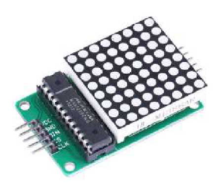

    <h1 class="title">Led-matrix</h1>
    <h2 class="subtitle">Toon een patroon met leds</h2>
    

        

            <h3 class="info_item_title">De led-matrix</h3>
            
De led-matrix is een vierkant raster van 8 bij 8 rode leds. Je kunt er patronen, symbolen of een gezicht mee tonen. In het testprogramma verschijnt een hartpatroon op het eerste segment van de matrix.

            </img>
        

        

            <h3 class="info_item_title">Aansluiten en instellen</h3>
            
De matrix gebruikt voeding via VCC en GND en ontvangt signalen via data (D), chip select (CS) en clock (CLK). Het testprogramma gebruikt <code>LedController.hpp</code> en stelt de SPI-pinnen in met <code>PIN_SPI_SCK</code>, <code>PIN_SPI_MOSI</code> en <code>PIN_SPI_SS</code>.

        

        

            <h3 class="info_item_title">Patroon tonen</h3>
            
Na de initialisatie activeert het programma alle segmenten, stelt het de helderheid in op 8 en wist het scherm. Daarna bevat <code>pattern</code> acht bytes: elke byte beschrijft welke leds in een rij branden. Met <code>displayOnSegment(0, pattern)</code> verschijnt het patroon op segment 0.

        

    

