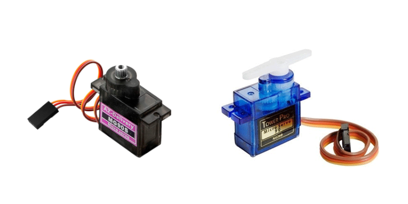

    <h1 class="title">Servomotor</h1>
    <h2 class="subtitle">Laat een motor naar een gekozen positie draaien</h2>
    

        

            <h3 class="info_item_title">De servomotor</h3>
            
Een servomotor is een actuator waarvan je de positie kunt aansturen. Een 180-gradenservo is geschikt voor nauwkeurige bewegingen, zoals een arm of grijper die naar een bepaalde hoek moet bewegen.

            </img>
        

        

            <h3 class="info_item_title">Aansluiten</h3>
            
Een servo heeft drie aansluitingen: GND voor massa, VCC voor de 5V-voeding en Signal voor het stuursignaal. In het testprogramma wordt de motor met <code>attach(SERVO_1)</code> aan de servo-aansluiting <code>SERVO_1</code> gekoppeld.

        

        

            <h3 class="info_item_title">De testbeweging</h3>
            
De test beweegt de servo in stappen van 15 graden van 0 tot 75 graden. <code>servoOnPinSERVO_1.write(i * 15)</code> stuurt de gewenste positie door; na elke stap wacht het programma 200 milliseconden.

        

    

