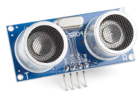

    <h1 class="title">Sonar-sensor</h1>
    <h2 class="subtitle">Meet de afstand tot een voorwerp</h2>
    

        

            <h3 class="info_item_title">De sonar-sensor</h3>
            
De sonar-sensor stuurt een ultrasoon geluidssignaal uit en meet wanneer de weerkaatsing terugkomt. Uit die tijd berekent de sensor de afstand tot een voorwerp in centimeter.

            </img>
        

        

            <h3 class="info_item_title">Aansluiten</h3>
            
De sensor gebruikt VCC voor 5V, GND voor massa, TRIG om een meting te starten en ECHO om de weerkaatsing te ontvangen. Het testprogramma gebruikt <code>A1</code> als TRIG en <code>A0</code> als ECHO, met een maximumafstand van 200 cm.

            
<table><tr><th>Sonar-sensor</th><th>Halberd</th></tr><tr><td>VCC</td><td>5V</td></tr><tr><td>GND</td><td>GND</td></tr><tr><td>TRIG</td><td>A1</td></tr><tr><td>ECHO</td><td>A0</td></tr></table>

        

        

            <h3 class="info_item_title">De testmeting</h3>
            
Met <code>sonarA1A0.ping_cm()</code> leest het programma de afstand. Is die 50 cm of kleiner, dan laat het programma RGB-led 1 blauw branden. Zo test je zowel de afstandsmeting als de reactie van de robot.

        

    

    

        <h3 class="example_item_title">Test de sonar-sensor</h3>
        
<pre><code class="language-cpp" data-filename="sonar_test.cpp">
#include &lt;Dwenguino.h&gt;
#include &lt;NewPing.h&gt;

#define TRIGGER_PIN_A1 A1
#define ECHO_PIN_A0 A0
#define MAX_DISTANCE 200

NewPing sonarA1A0(TRIGGER_PIN_A1, ECHO_PIN_A0, MAX_DISTANCE);

void setup() {
    initDwenguino();
}

void loop() {
    if (sonarA1A0.ping_cm() &lt;= 50) {
        digitalWrite(RGB_1_B, HIGH);
    } else {
        digitalWrite(RGB_1_B, LOW);
    }
    delay(100);
}
</code></pre>

    

