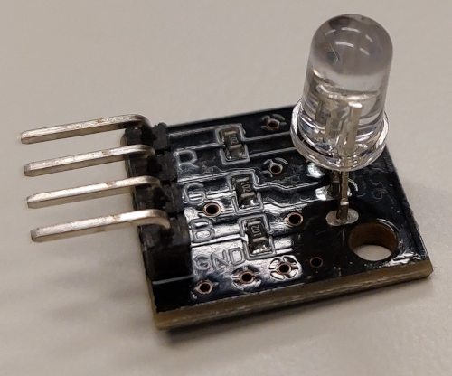

    <h1 class="title">RGB-led</h1>
    <h2 class="subtitle">Geef de robot een kleurensignaal</h2>
    

        

            <h3 class="info_item_title">De RGB-led</h3>
            
Een RGB-led combineert rood, groen en blauw licht. Door de intensiteit van elk kanaal te kiezen, maak je verschillende kleuren. Elke intensiteit ligt tussen 0, uit, en 255, volledig helder.

            </img>
        

        

            <h3 class="info_item_title">Halberd-aansluitingen</h3>
            
Het testprogramma gebruikt de ingebouwde RGB-led 1 met <code>RGB_1_R</code>, <code>RGB_1_G</code> en <code>RGB_1_B</code>. Stel deze drie pinnen in als uitvoer en gebruik <code>analogWrite()</code> om de helderheid per kleurkanaal te bepalen.

        

        

            <h3 class="info_item_title">De testkleuren</h3>
            
De RGB-led geeft de toestand van het testprogramma weer: blauw wanneer de sonar een voorwerp tot 50 cm detecteert, groen wanneer de oostknop is ingedrukt en rood in alle andere gevallen.

        

    

