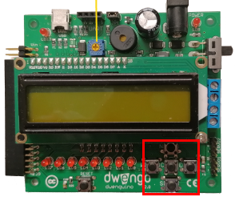

    <h1 class="title">Knoppen</h1>
    <h2 class="subtitle">Gebruik een knop als invoer</h2>
    

        

            <h3 class="info_item_title">De knoppen</h3>
            
Knoppen geven je programma een eenvoudige invoer: ingedrukt of niet ingedrukt. Je kunt ze gebruiken om een actie te starten of een toestand van je robot te kiezen.

            </img>
        

        

            <h3 class="info_item_title">Knopnamen</h3>
            
De richtingsknoppen heten <code>SW_N</code>, <code>SW_S</code>, <code>SW_E</code> en <code>SW_W</code>. De middelste knop heet <code>SW_MIDDLE</code>. Het testprogramma kiest <code>SW_E</code>, de oostknop, en configureert die als <code>INPUT_PULLUP</code>.

        

        

            <h3 class="info_item_title">De testreactie</h3>
            
Het programma leest de oostknop met <code>digitalRead(BUTTON_PIN_SW_E)</code>. Wanneer de voorwaarde voor de knop wordt bereikt en de sonar geen voorwerp dichtbij ziet, brandt RGB-led 1 groen.

        

    

