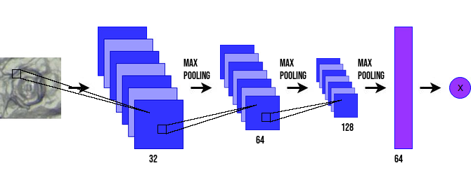
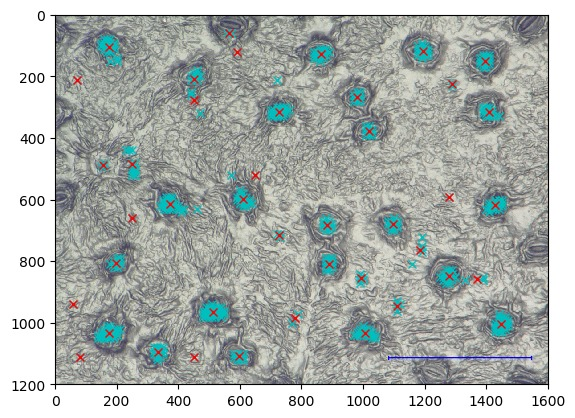

# Stomatadetectie
In deze notebook wordt een diep neuraal netwerk gebruikt om stomata op een grote afbeelding te herkennen.  

----------------
Dit diep neuraal netwerk netwerk bestaat uit drie convolutionele lagen, aangevuld met één feedforward laag. De volgende afbeelding toont de architectuur van dit netwerk.

 

Dit neuraal netwerk kan een classificeren tussen 2 klassen ('Stoma' of 'Geen stoma') wanneer het een afbeelding van 120 pixels op 120 pixels krijgt als invoer. 

Het systeem moet echter ook in staat zijn om de stomata op een grote afbeelding te vinden. Bijvoorbeeld de stomata op een microscopische foto van 1600 x 1200 pixels, hierbij verondersteld dat de stomata ongeveer 120 x 120 pixels groot zijn op de foto.  
Om dit te verwezenlijken wordt een ander algoritme ingezet dat een sliding window gebruikt.
-  A.d.h.v. een (glijdend) venster van 120 x 120 pixels wordt er een vierkantje uit de grote afbeelding geknipt.
-  Dat vierkantje wordt dan als invoer van het getrainde netwerk gebruikt, waarop het netwerk dan een *voorspelling* zal geven voor dat vierkantje.
-  Daarna schuift het venster naar rechts op met 10 pixels, en het proces herhaalt zich.
-  Wanneer het vierkantje de volledige breedte van de afbeelding heeft doorlopen, zal het opnieuw naar de linkerkant verspringen, maar dan 10 pixels lager dan voorheen.
-  Heel dit proces herhaalt zich tot de volledige afbeelding verwerkt werd met telkens sprongen van 10 pixels.

Dit proces wordt geïllustreerd in de volgende afbeelding.  
Rechts van de afbeelding zie je hoe zeker het netwerk is van de voorspelling. Een voorspelling van '1' betekent dat het netwerk 100 % zeker is dat het vierkantje een stoma bevat, een voorspelling van '0,35' betekent dat het netwerk 35 % zeker is dat het vierkantje een stoma bevat, en een voorspelling van '0' betekent dat het netwerk oordeelt dat het vierkantje zeker geen stoma bevat.  Zodra de waarde groter wordt dan 0,5 (dit is een opgegeven drempelwaarde: zie later), wordt het vierkantje geel en valt het in de klasse 'Stoma'.

 

Voor elke vierkantje dat uit de grote afbeelding geknipt wordt, zal er op deze manier een voorspelling gemaakt worden.  
Omdat er slechts opgeschoven wordt over 10 pixels, zullen er voor elk huidmondje telkens meerdere vierkantjes zijn die ingedeeld worden in de klasse 'Stoma' i.p.v. één.  Omdat er slechts met 10 pixels wordt opgeschoven, zullen sommige vierkantjes dus niet veel van elkaar verschillen. Dat zou ertoe leiden dat een huidmondje meerdere keren worden geteld. 
Om deze vele positieve voorspellingen samen te voegen, gebruikt men clusteren. **Clustering** zal punten die dicht bij elkaar liggen als één cluster beschouwen en het middelpunt van deze clusters is dan de gevonden stoma.  

Volgende afbeelding geeft een voorbeeld van clustering: de blauwe kruisjes zijn de gevonden stomata; die dicht bij elkaar worden geclusterd; de rode kruisjes zijn het middelpunt van elke cluster.

 

Bij de detectie speelt de **drempelwaarde** een belangrijke rol. Deze drempelwaarde bepaalt voor welke waarden van de uitvoer het netwerk de invoer als een stoma beschouwt. Als je bijvoorbeeld 0,5 als drempelwaarde neemt, dan zal alle uitvoer met een zekerheid groter dan 0,5 als 'Stoma' geclassificeerd worden en alle uitvoer kleiner dan 0,5 als 'Geen stoma'. 

Een belangrijke afweging die je moet maken bij het kiezen van de drempelwaarde is de verhouding tussen ***precision*** en ***recall***. 

-  Precision: het percentage van de gevonden stomata dat ook daadwerkelijk stomata zijn.</li>
-  Recall: het percentage van het aantal stomata op een afbeelding dat daadwerkelijk gevonden werd.</li>

Het is duidelijk dat een lage drempelwaarde zal zorgen voor een lage precision (er worden meer punten als stomata beschouwd, dus ook meer foute punten; er zijn dan meer **vals positieven**) maar een hoge recall (van de stomata gaan er ook meer gevonden worden). Andersom geldt dat een hoge drempelwaarde zal zorgen voor een hoge precision maar lage recall (er zullen meer **vals negatieven** zijn).

Zie ook het onderdeel 'Drempelwaarde' in het leerpad 'Maatschappelijke aspecten' van het KIKS-project. 
