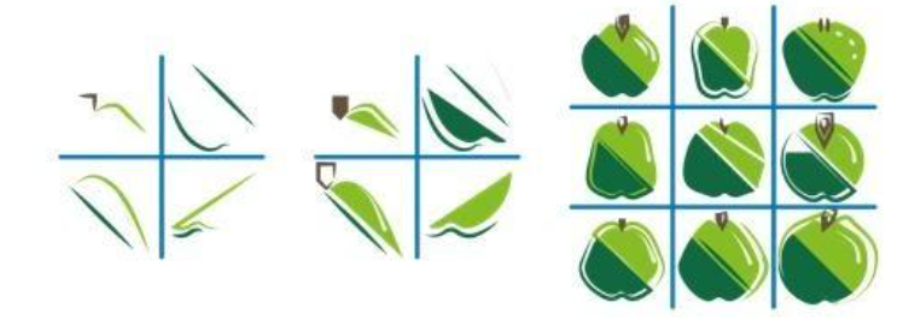

# Convoluties en andere technieken
Met convoluties kan je op zoek gaan naar verschillende kenmerken in een afbeelding. Je kan er bv. randen mee detecteren, ruis in een beeld mee verminderen of het contrast in een beeld verzachten. Convoluties worden toegepast in de zogenaamde convolutionele netwerken.  
De eerste notebook gaat hier dieper op in.

Behalve convoluties worden er ook nog andere technieken gebruikt, zoals ReLU en max pooling.  Daar gaat de tweede notebook over. 

---
> De convolutie is een wiskundige bewerking die enkel gebruikmaakt van optellen en vermenigvuldigen. Het komt erop neer dat men aan een pixel een bepaald gewicht geeft en men daaraan gewogen waarden van de omliggende pixels toevoegt.

Met convoluties kan men op zoek gaan naar verschillende kenmerken in een afbeelding. Men kan er bv. verticale en horizontale lijnen mee detecteren, ruis in een beeld mee verminderen of het contrast in een beeld verzachten. In elke laag van het convolutionele neurale netwerk wordt de representatie van de gegevens door de convoluties getransformeerd in een nieuwe representatie van de gegevens.

