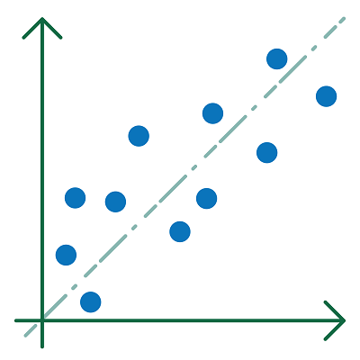

# Regressie en classificatie

**Een machine learning-systeem verwerft met lerende algoritmes kennis uit data met de bedoeling uitkomsten te kunnen voorspellen betreffende nieuwe data.** 

        <ul>Het voorspellen gebaseerd op tendensen is een <b>regressieprobleem</b>.</ul>
        <ul>Het voorspellen van een klasse is een <b>classificatieprobleem</b>.</ul> 
Voorspellen betekent bijvoorbeeld dat er uit voorbije tendensen cijfers voor de toekomst gegenereerd worden (regressie) of dat een object bij een bepaalde categorie (klasse genoemd) wordt ingedeeld (classificatie).

   
> **Concrete voorbeelden van regressie:**  
> - de prijs van een appartement voorspellen of beslissen (gebaseerd op de prijzen van appartementen die reeds verkocht zijn); 
> - uit het afnemen van de dikte van een gebergtegletsjer gedurende de voorbije decennia, de dikte van de komende jaren afleiden.  

> **Concrete voorbeelden van classificatie:**  
> - bepalen of een e-mail al dan niet spam is;  
> - van een foto kunnen zeggen of er al dan niet een huidmondje op staat.

 
<figure>
    <figcaption align = "center">Regressie.</figcaption>
</figure> 

 
<figure>
    <figcaption align = "center">Classificatie.</figcaption>
</figure> 

Met machinaal leren kan men dus problemen van regressie en classificatie behandelen. Deze technieken worden voorgesteld in respectievelijk de leerpaden ['Classificatie'](https://www.dwengo.org/learning-path.html?hruid=kiks5_classificatie&language=nl&te=true&source_page=%2Fkiks%2F&source_title=%20KIKS#kiks_mnist;nl;3) en ['Regressie'](https://www.dwengo.org/learning-path.html?hruid=kiks6_regressie&language=nl&te=true&source_page=%2Fkiks%2F&source_title=%20KIKS#kiks_iris_regressie;nl;3).
