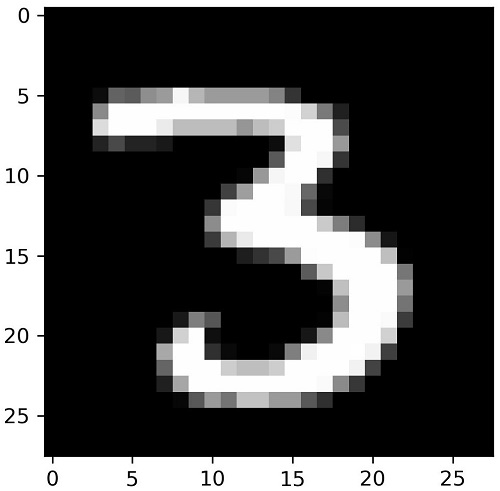

# MNIST
De MNIST-dataset bestaat uit 70.000 afbeeldingen van handgeschreven cijfers, elk 28 x 28 pixels in grijswaarden. 

<figure>
    <figcaption align = "center">Een drie uit de MNIST-dataset.</figcaption>
</figure>

Van de afbeeldingen in de MNIST-dataset worden er 60.000 gebruikt om een neuraal netwerk te **trainen** en 10.000 om het te **testen**.
Het uiteindelijke neurale netwerk dient om handgeschreven cijfers te kunnen herkennen die het netwerk niet eerder gezien heeft.

In een eerste notebook werk je met een **feedforward neuraal netwerk**. 
In een tweede notebook werk je met een **convolutioneel neuraal netwerk**; hier gebruik je naast een training- en testset ook een **valideringsset**.   
Je kan de opbouw en de prestaties van deze netwerken met elkaar vergelijken. Door de parameters in deze netwerken aan te passen verwerf je inzichten in de invloed van deze parameters op de training en de prestaties. 

