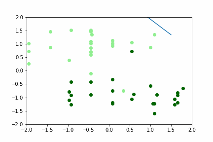

# Stomata zon - schaduw
Het aanmaken van stomata wordt beïnvloed door omgevingsfactoren. Je leert aan de computer om stomata van bezonde planten en van planten in de schaduw van elkaar te onderscheiden.

 
 
  Met dank aan M. Camargo en R. Marenco voor de gedeelde data.
 Camargo, M. & Marenco, R. (2012). Growth, leaf and stomatal traits of crabwood (Carapa guianensis Aubl.) in Central Amazonia. Revista Árvore, 36, 07–16.
